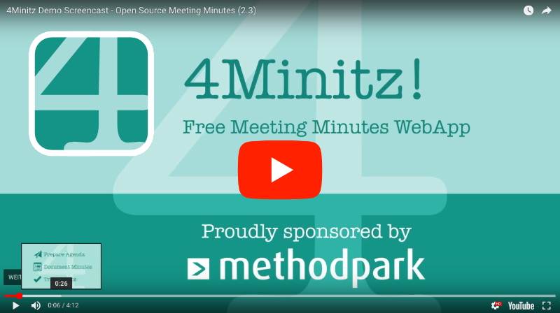

develop/
[](https://github.com/bubonicfred/5minitz/actions?query=workflow%3A%224Minitz+CI+TestRunner%22)
[](https://depfu.com/github/bubonicfred/5minitz?project_id=30798)

# 5Minitz!
This is an attempt to maintain 4minitz. 

The main branch is currently identical to 4minitz/develop.

The develop branch is currently functionally the same, with some dependancy updates.

I have no immidiate plans for feature changes, though the front end might have to be re-done at some point.

Also the name is not set in stone.


_Simply ~~the best~~ a decent free webapp for taking meeting minutes._

- Create a meeting series and invite others
- Specify moderators, invited and informed users
- Create an agenda with multiple topics
- Attend a meeting via web with reactive live updates
- 1-button sending of agenda, minutes and action items by email
- Use labels to tag items for later retrieval
- Upload binary attachments to minutes (e.g., presentations, photos)
- Track open action items and unfinished topics across meetings
- Full privacy: Host your own server - it's easy!

<a href="https://raw.githubusercontent.com/bubonicfred/5minitz/develop/doc/4minitz_screenshot.png"></a>

_(Click to enlarge screen shot)_

<br>

[](https://www.youtube.com/watch?v=v28q6AaEySQ)

_(Click to play Demo Video)_

Documentation is "continuously" not finished... Nevertheless these WIP docs may
be of help:

- [FAQ - Frequently Asked Questions](doc/faq.md)
- [User Doc](doc/user/usermanual.md)
- [Admin Guide](doc/admin/adminguide.md)
- [Developer Doc](doc/developer/developermanual.md)

## External Project Links

** These still link to 4minitz links **

- [4Minitz Backlog](https://github.com/4minitz/4minitz/projects/1) - organizes
  our project TODOs
- [4Minitz Demo Server](https://www.4minitz.com) - well, our Demo server ;-)
- [GitHub Actions](https://github.com/4minitz/4minitz/actions?query=workflow%3A%224Minitz+CI+TestRunner%22) -
  Runs unit and end2end tests on each commit
- [Code Climate](https://codeclimate.com/github/4minitz/4minitz) - Keeps an eye
  on our code quality
- [CLA Assist](https://cla-assistant.io/4minitz/4minitz) - Manages signing of
  our Contributor License Agreements
- [Docker Hub](https://hub.docker.com/r/4minitz/4minitz/) - Spin up your own
  4Minitz server in seconds


## Deployment Quick Start

To quickly set up a local demo of 4Minitz at your site for evaluation and
testing you can use our sample
[Docker Compose configuration file](docker-compose.yml)
and run it with

```sh
docker-compose up
```
TODO:update docker-compose
You can now access 4Minitz by pointing your browser to
[http://localhost:3100](http://localhost:3100).

If you don't want to use `docker-compose` you can use just docker by starting
the two containers manually:

```sh
docker run --rm --name mongo mongo
docker run --rm --name 4minitz \
    -v $PWD/4minitz_storage:/4minitz_storage \
    -p 3100:3333 \
    -e MONGO_URL=mongodb://mongo/4minitz \
    --link mongo \
    4minitz/4minitz:stable
```

Don't miss the [Admin Guide](doc/admin/adminguide.md) with a more comprehensive
coverage of the real production building & installation topic! Especially see
[how to configure your 4Minitz docker server](doc/admin/adminguide.md#production-running---with-docker).

## Development environment (Linux, Mac)

**Attention:** This is not a proper setup for production deployment! It is
intended for developers and so it has some security drawbacks (No password
protection for MongoDB) and also consumes some amount of extra RAM (>700 MB)).
Don't miss the [Admin Guide](doc/admin/adminguide.md) with a more comprehensive
coverage of the real production installation topic!

Tests currenly running with meteor 1.6.1.4

### Prerequisites

4minitz is realized with the [Meteor JS Framework](http://www.meteor.com). So,
first install the current version of meteor:

```sh
curl https://install.meteor.com/ | sh
meteor --version
```

On Windows? [Download the meteor installer](https://install.meteor.com/windows).
As an experienced Windows admin you sure can transfer the below steps for Linux
and Mac to your OS.

### Run development version (Linux & Mac)

Once Meteor is set up you can clone and run 4Minitz from source like this:

```sh
git clone https://github.com/4minitz/4minitz.git
cd 4minitz
cp settings_sample.json settings.json
./runapp.sh
```

Wait some time for meteor to finish downloading and building. You can reach
4Minitz via the default port 3100 by opening
[http://localhost:3100](http://localhost:3100) in your browser

**Hint:** There is a settings_sample.json file that has quite a few
configuration options (like sending eMails etc.). Don't miss the
[Admin Guide](doc/admin/adminguide.md) with more details on this topic.
