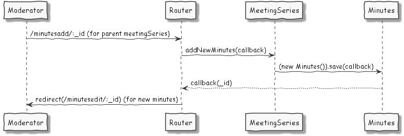

# Developer Readme for 4Minitz

## General Info
* We use this [successful git branching strategy](http://nvie.com/posts/a-successful-git-branching-model/)
* For generating the UML figures in this doc we use [PlantUML](http://plantuml.com/)
  (respective the [PlantUML plugin](https://plugins.jetbrains.com/plugin/7017?pr=) for JetBrains products)
* We use ES2015 (ES6) as we make progress in learning it.
* Before merging new features, read our ["Definition of Done"] ()


## DoD - Our "Definition of Done"
* __Acceptance critera__: from the user story are checked and work OK
* __Responsiveness:__ Your user story shall look great on small (<= 480px width) and large (>1000px) screens
* __Unit- and integration tests:__ do cover your new code
* __Documentation updated:__ the developer doc and the user doc are updated
* __No client-side exceptions:__ Check your user story and watch the browser console
* __No server-side exceptions:__ Check your user story and the meteor console
* __No open issues:__ on your user story
* __Create issues:__ if your tests discover issues in other already implemented user stories: write a [github issue](https://github.com/4minitz/4minitz/issues) 
* __ES2015:__ Where possible we use ES2015 language features


## Running Tests

We use several approaches to test as many aspects of our application as possible.

### Unit Tests

Unit tests are stored in ```tests/unit```. They are implemented so they do not use any meteor dependencies at all. In order
to execute unit tests run

    meteor npm test


### Integration Tests

In order to execute integration tests you need to either run the meteor test server

    meteor test --driver-package practicalmeteor:mocha

and open localhost:3000 in your browser to run the tests or run

    meteor test --once --driver-package dispatch:mocha-phantomjs

to run them headless, e.g. on a CI. Optionally add commandline switch *--port 3100*
to run tests in parallel to the meteor application.

Further information  on testing with meteor can be found at http://guide.meteor.com/testing.html
and http://info.meteor.com/blog/full-app-testing-in-meteor

### End2End Tests

End-to-End tests are stored in directory ```tests/end2end/``` and use the [chimp package](https://chimp.readme.io), which first needs to be installed globally.
Hint: The chimp package needs an installed Chrome browser.
To run the e2e tests, you need to run the server in "end2end" mode. 

    meteor npm run test:end2end:server

This will set some specific e2e settings from ```settings-test-end2end.json```. 
Then run the chimp tests:

    chimp --ddp=http://localhost:3100 --mocha --path=tests/end2end/


## Where to start
Our work-horses are the classes in /imports/ (e.g. meetingseries.js, minutes.js).
They build a facade for the underlying MongoCollections and enrich them with convenience methods.

## Use Cases


## Class Diagrams


## Sequence Diagrams


## MongoDB Collection Schema

See *.schema.js files in imports/collections.

## MongoDB Migrations

Migrations are realized with the percolate:migrations package. To adjust existing databases to a new schema add
new migration up() and down() functions to /server/migrations.js.
