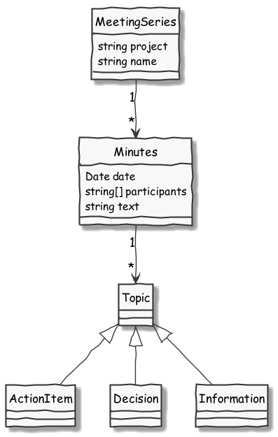

# Developer Readme for 4Minitz

## General Info
* We use this [successful git branching strategy](http://nvie.com/posts/a-successful-git-branching-model/)
* For generating the UML figures in this doc we use [PlantUML](http://plantuml.com/)
  (respective the [PlantUML plugin](https://plugins.jetbrains.com/plugin/7017?pr=) for JetBrains products)
* We use ES2015 (ES6) as we make progress in learning it.


## Running Tests
In oder to execute tests you need to run the following meteor command.

    meteor test --driver-package practicalmeteor:mocha
    meteor test --driver-package practicalmeteor:mocha --full-app

The ```-full-app``` allows to use published collections, routes, methods in the tests.
Optionally add commandline switch *--port 3100* to run tests in parallel to the meteor application.

Further info on testing with meteor can be found at http://guide.meteor.com/testing.html and http://info.meteor.com/blog/full-app-testing-in-meteor


## Where to start
Our work-horses are the classes in /imports/ (e.g. meetingseries.js, minutes.js).
They build a facade for the underlying MongoCollections and enrich them with convencience methods.

## Use Cases


## Class Diagrams



## Sequence Diagrams


## MongoDB Collection Schema
    MeetingSeries {
        "_id": AbcDeFGhIj,                      // auto-assigned by mongo
        "createdAt": "YYYY-MM-ddThh:mm:SS.sssZ" // timestamp
        "lastMinutesDate": "YYYY-MM-dd"         // date of newest minutes in this series
        "project": "xxxxxx",
        "name": "xxxxxx",
        "minutes": [
                AbcDeFGhIj,  // _id reference to a child Minutes._id
                AbcDeFGhIj,
                AbcDeFGhIj,
                AbcDeFGhIj,
                ...
        ],
        "relatedTopics": [  {  // open/closed topics from finalized minutes of this series
            "_id": AbcDeFGhIj,                // self-generated by Random()
            "subject": "...",
            "responsible": "...",
            "priority": "...",
            "duedate": "YYYY-MM-dd",
            "isOpen": (true|false),
            "details": [  {
                         date:
                         text:
                        },
                         {
                           date:
                           text:
                          },
                         // .....
              ]  // end-of details
             } ,
             {
              "_id": AbcDeFGhIj,                // self-generated by Random()
              "subject": "...",
              "responsible": "...",
              "priority": "...",
              "duedate": "YYYY-MM-dd",
              "isOpen": (true|false),
              "details": [  {
                           date:
                           text:
                          },
                         {
                           date:
                           text:
                          },
                         // .....
              ]  // end-of details
             }             // .....
        ]  // end-of relatedTopics
    }
    
    Minutes {
        "_id": AbcDeFGhIj,                        // auto-assigned by mongo
        "createdAt": "YYYY-MM-ddThh:mm:SS.sssZ",  // timestamp of creation
        "meetingSeries_id": "AbcDeFGhIj",         // _id reference to parent MeetingSeries._id
        isFinalized: (true|false),                // indicates if the minutes is finalized
        isUnfinalized: (true|false),              // indicates if the minutes is currently un-finalized (if it was finalized previously)
        "finalizedAt": "YYYY-MM-ddThh:mm:SS.sssZ",// timestamp of finalization
        "finalizedBy": AbcDeFGhIj,                // user id of the user who finalized this minutes
        "date": "YYYY-MM-dd",                     // date of these minutes
        "participants": "name1, name2, ...",      // free-text for participants
        "agenda": "...",                          // free-text for agenda
        "topics": [  {
              "_id": AbcDeFGhIj,                  // self-generated by Random()
              "subject": "...",
              "responsible": "...",
              "priority": "...",
              "duedate": "YYYY-MM-dd",
              "isOpen": (true|false),
              "details": [  {
                           date:
                           text:
                          },
                         {
                           date:
                           text:
                          },
                         // .....
              ]  // end-of details
             } ,
             {
              "_id": AbcDeFGhIj,                  // self-generated by Random()
              "subject": "...",
              "responsible": "...",
              "priority": "...",
              "duedate": "YYYY-MM-dd",
              "isOpen": (true|false),
              "details": [  {
                           date:
                           text:
                          },
                         {
                           date:
                           text:
                          },
                         // .....
              ]  // end-of details
             }             // .....
        ]  // end-of topics
    }
