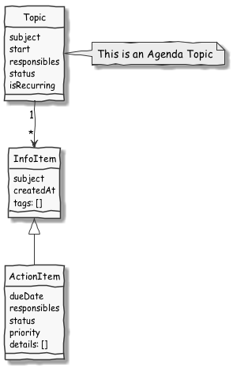

# Developer Readme for 4Minitz

<!-- HowTo update table of content -->
<!--    npm install --save markdown-toc -->
<!--    markdown-toc -i --maxdepth 2 developermanual.md -->

## Table of Content

<!-- toc -->

- [General Info](#general-info)
- [DoD - Our "Definition of Done"](#dod---our-definition-of-done)
- [Running Tests](#running-tests)
- [Code Quality](#code-quality)
- [Database Seeding](#database-seeding)
- [Coding - Where to start](#coding---where-to-start)
- [Use Cases](#use-cases)
- [Class Diagrams](#class-diagrams)
- [Sequence Diagrams](#sequence-diagrams)
- [Sending E-Mails](#sending-e-mails)
- [Sending info items and action items](#sending-info-items-and-action-items)
- [MongoDB Collection Schema](#mongodb-collection-schema)
- [MongoDB Migrations](#mongodb-migrations)
- [Accessing the servers root url](#accessing-the-servers-root-url)

<!-- tocstop -->

## General Info
* We use this [successful git branching strategy](http://nvie.com/posts/a-successful-git-branching-model/)
* For generating the UML figures in this doc we use [PlantUML](http://plantuml.com/)
  (respective the [PlantUML plugin](https://plugins.jetbrains.com/plugin/7017?pr=) for JetBrains products)
* We use ES2015 (ES6) as we make progress in learning it.
* Before merging new features, read our ["Definition of Done"](#dod)


## <a name="dod">DoD - Our "Definition of Done"</a>
* __Acceptance critera__: from the user story are checked and work OK
* __Responsiveness:__ Your user story shall look great on small (<= 480px width) and large (>1000px) screens
* __Unit tests:__ do cover your new code
* __Documentation updated:__ the developer doc and the user doc are updated
* __Code Quality:__ the code passes our eslint rules and no eslint errors will be thrown
* __No client-side exceptions:__ Check your user story and watch the browser console
* __No server-side exceptions:__ Check your user story and the meteor console
* __No open issues:__ on your user story
* __Create issues:__ if your tests discover issues in other already implemented user stories: write a [github issue](https://github.com/4minitz/4minitz/issues) 
* __ES2015:__ Where possible we use ES2015 language features


## Running Tests

We use several approaches to test as many aspects of our application as possible.

### Unit Tests

Unit tests are stored in ```tests/unit```. They are implemented so they do not use any meteor dependencies at all. In order
to execute unit tests run

    npm run test:unit

### End2End Tests

End-to-End tests are stored in directory ```tests/end2end/``` 
and use the [chimp package](https://chimp.readme.io), 
which first needs to be installed globally (`sudo npm install -g chimp`).
Hint: The chimp package needs an installed Chrome browser.
To run the e2e tests, you need to run the server in "end2end" mode. 

    npm run test:end2end:server

This will set some specific e2e settings from ```settings-test-end2end.json```. 
Then run the chimp tests use `once` mode or in `watch` mode with an installed 
Chrome instance

    npm run test:end2end:once
    npm run test:end2end:watch

or run them headless with phantomjs, 
which is included in our test runner chimp

    npm run test:end2end:headless


#### Headless debugging with screenshots
To debug headless testcases that run red, you can create screenshots at
interesting timepoints in your tests by either calling WebDriver.io's:

    browser.saveScreenshot("my-testcase");
    
or by calling our convenience wrapper function:
    
    E2EGlobal.saveScreenshot("my-testcase");
    
where the later one adds a timestamp (YYYYMMDDHHMMSS plus milliseconds) in front 
of the file name to create unique names. The screenshots of the headless
browser are stored in ```/tests/snapshots```.

Our headless end-2-end` tests are also executed on our CI platform
Travis-CI. To debug red testcases on Travis-CI, all screenshots are
uploaded as "artifacts" to our Amazon AWS S3 storage. After a Travis build
has completed, you can watch all created screenshots via this URL:
[http://s3files.4minitz.com/4minitz/4minitz](http://s3files.4minitz.com/4minitz/4minitz)

## Code Quality
We use [eslint](http://eslint.org/) to make static code analysis to keep our code quality constantly high. Our set of
rules is defined in the [.eslintrc.json](../../.eslintrc.json) configuration file.

You can run eslint to check the code by executing the npm script `eslint`:

    npm run eslint
    
Some rules can be applied automatically like correcting file indention or transforming double quoted literals into
single quoted ones (yes we use single quotes like recommended in the 
[Google JavaScript Style Guide](https://google.github.io/styleguide/jsguide.html#features-strings-use-single-quotes) 
together with template strings if necessary). To automatically fix all those errors which can be fixed automatically
run the npm script `eslint:fix`:

    npm run eslint:fix

 
## Database Seeding
 
Sometimes it is necessary that there are some test data available in the database. Therefore you can use our
minutes seeding tool. This tool allows to insert a meeting series with dummy entries. The series contains
a custom amount of minutes containing a custom amount of topics and items.

Simply execute:
    
    npm run fixtures:seed-minutes
    
The parameter `--help` displays all command-line options:

    npm run fixtures:seed-minutes -- --help

## Coding - Where to start
Our work-horses are the classes in /imports/ (e.g. meetingseries.js, minutes.js).
They build a facade for the underlying MongoCollections and enrich them with convenience methods.

## Use Cases


## Class Diagrams





## Sequence Diagrams


## Sending E-Mails

We provide different ways for sending emails. Currently sending mails via smtp or the mail delivery service
[mailgun](http://www.mailgun.com/) is supported. Via the configuration file settings.json you can define globally which
service should be used (for configuration go to [Admin Doc](../admin/adminguide.md#configuration-for-sending-emails)).

To achieve this you should not use Meteor.mail() for sending mails directly. Instead you can use our MailFactory to get
a concrete instance of the abstract Mail-Class. This class defines the API for sending mails and is currently
implemented by a class called MeteorMail which uses the meteor api for sending emails and a class MailgunMail which uses
the mailgun api for sending emails.


You can get a concrete Mail-Instance via the static method getMailer(replyTo, recipients) of the MailFactory. You have
to provide the two parameters replyTo (string) and recipients. Recipients can either be a string representing an email
address or an array of email addresses. As a result you will ge a Mail-Object.

With this object you can prepare your email by providing a subject, setting a email text as either plain text or html
or both. After that you can send the email by calling the Method send() of the Mail-Object.

When sending the mail by calling the send method, the abstract class Mail takes care about some general things like 
checking if the necessary parameters are set. Then it calls the abstract method _sendMail() which will be implemented
by the concrete implementation either MeteorMail or MailgunMail which takes care about actually sending the mail.
Afterwords the send-method of the Mail-Class takes care about logging the result.

The following sequence diagram shows the process of sending mails using the concrete meteor mail object as an example.
But you should never use the constructor of a Mail class directly. Instead you should always use the MailFactory to 
get an instance of a Mailer.


 
### Adding a different email deliverer

If you want to add an additional email service you have to write your own class which derives from the abstract class
Mail. In your class you have to implement the method _sendMail() only. There you can access the attributes _replyTo, 
_recipients, _from, _html and _text for building and sending the mail. Then you have to adjust the MailFactory so that
it will return your implementation depending on the current configuration. Do not forget to adjust the settings_sample.json
file to draw attention to your new email delivery service.

## Sending info items and action items

For sending info items or action items you can use the classes InfoItemsMailHandler and ActionItemsMailHandler,
respectively. Both classes are derivations from the abstract class TopicItemsMailHandler. This class provides the base
features for sending action or info items.


The following sequence diagram shows the process of sending info items. If you pass multiple recipients to the 
InfoItemsMailHandler depending on the isTrustedIntranetEnvironment configuration the info items will be sent to all
recipients in one mail (all recipients in the TO-field) or if the system is not in a trusted intranet environment
the info items will sent to all recipients separately.
Sending action items works analog.


The email layout will be provided as a spacebars template. You can pass a template name to the TopicItemsMailHandler 
which must be found under the path "/private/server_side_templates/email" (e.g InfoItemsMailHandler uses the template 
"publishInfoItems"). In a concrete derivation of the base class you have to call the method _buildMail() of the base 
class and pass the subject and the data required by the template as parameters. The method _buildMail() will then take 
care about rendering the template and sending the email.

## MongoDB Collection Schema

See *.schema.js files in imports/collections.

## MongoDB Migrations

Migrations are realized with the percolate:migrations package. To adjust existing databases to a new schema add
new migration up() and down() functions to /server/migrations.js.

## Accessing the servers root url

If you have to generate an absolute URL (e.g. for links in emails) do not use Meteor.absoluteUrl() ! Instead use
GlobalSettings.getRootUrl(path [optional]). This method does all the necessary stuff for you ;-)
