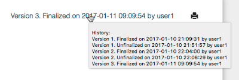

# 4Minitz FAQ - Frequently Asked Questions

### 4Minitz is a cumbersome name - what does it mean?
The 4Minitz webapp is simply "for the minutes".  ;-)

(Some people also told us that setting up the server was done in only *four minutes*).


### What does the "red warning message" mean?
See first chapter of the [user doc](user/usermanual.md). This message warns you that your client lost connection to the server. Either the server is down or your internet connection is weak. All changes made from now on are lost if you close your browser window before the connection is re-established and offline syncing could finish.

### Topics, Info Items, Action Items, Details? I don't get it...?!
4Minitz offers the following hierarchy to structure your meeting minutes:

```
   Topic
     |
     +-- Info Item
            +-- Detail (Markdown)
     +-- Action Item
            +-- Detail (Markdown)
```

* **Topics:** are the agenda points that have to be discussed. Topics can be automatically recurring at every meeting. And can be skipped once. They are usually created before the actual meeting and sent via agenda mail.
* **Info Items:** Are usually created during topic discussion. Info items inform the outside world about what was discussed for a specific topic. Labels (e.g., #Decision) allow classification of info items. If one line of text is not enough add details.
* **Action Items:** Are created during topic discussion. Action items document WHO-WHAT-WHEN if something has to be done to drive a topic forward. Action items keep their parent topic alive until they are all done. If one line of text is not enough add details.
* **Details:** You can add as many detail nodes to an action/info item as needed. Even in future meetings. Inside details you may use Markdown syntax to add some layout to your details text.

### Markdown? Never heard of it!
Markdown is a text-only syntax that allows to add layout like headings, bullet list, numbered lists, bold, italic, underline and strike through.

You may use markdown syntax in details below info items and action items.

For a complete reference of layout commands see [Markdown Reference](https://guides.github.com/features/mastering-markdown/).

### I accidentally deleted an Info Item, Action Item, Topic, Meeting Minutes, or Meeting Series. How can I un-delete it?
 Unfortunately this is not possible. That why we implemented a security question in front of any destructive action.


### When is a TOPIC automatically propagated to the next meeting?
  A topic is automatically propagated to the next meeting if one of the following conditions is met:
  1. the topic is **not "checked"** as "done for this meeting" - or
  1. the topic is **marked as "recurring"** with the blue circle icon - or
  1. the topic has at least one **open action item** which is not checked as done.


### When is an ACTION ITEM automatically propagated to the next meeting?
 An action item is propagated to the next meeting as long as it is **not checked as done**


### When is an INFORMATION ITEM automatically propagated to the next meeting?
 An information item normally is a "one shot item" that is sent as part of the meeting minutes to all invited people. So it sticks to the meeting minutes where it was created and does not show up the next time. But you can "pin" an information item to its topic - this will propagate it to all future meetings as long as
 1. You keep the info item pinned - and
 1. The parent topic is also propagated to the next meeting (see question above "When is a topic automatically propagated to the next meeting?").

 This means: A pinned information item *does not* force its topic to propagate. And: If the topic does not propagate, child info items will also not propagate.


### How can I become the moderator of a meeting series?
 Two ways:
 1. You create the meeting series. Now you will be moderator of this meeting series
 1. Someone else is moderator of the meeting series. A moderator can promote other users to be also moderators.


### How can I invite other people to a meeting series?
 If you are a moderator of the meeting series, open the "Meeting Series Properties Editor" via the "top-right cog icon. Select the section "Invited Users". Enter the first letters of the username, then select the to-be-invited users. Finally click the "Save" button to persist your changes.


### How can I leave a meeting series?
**If you are a moderator**: You cannot remove yourself from the series alone. This is to ensure that there are no orphaned meeting series without any moderators. You, as a moderator, can leave the meeting series the following way: First make someone else to the moderator. Then ask this person to remove your user from the series. This can be done with the "Meeting Series Editor".

The only other chance is that you delete the Meeting Series

 **If you are not moderator**: Log in to 4Minitz. On the list of your visible meeting series click on the meeting series. On the meeting series view click the button "Leave Meeting Series".


### How can I add further labels to a meeting series or change existing labels text or color?
 Open the meeting series, then click the "cog icon" to open the meeting series properties editor. Then open the section "Labels". Here you can add, remove and edit labels. During edit you can change the label text and the label color.
 **Important: Changes to an existing label (even deleting it!) will change all past meeting minutes that used this label.**


### Is there a fast way to create a label during a minute?
 If you enter an action item or info item subject with a "#string" (with preceding space!) in it, this string will be added as new label to the meeting series and is available in all future meeting series. The color code will be gray.
 For example enter the following text to an action item or info item subject: **"This is my new item #Important"**. From now on you will have the "Important" label in you label selection list.

 Power users may add an additional color code by providing an RGB hex color code like so: **"This is my new item #Important#ff0000"**


### My meeting minute is finalized but contains some error. How can I fix it? Is it possible to do an "un-finalize"?
 Only the latest meeting minutes can be unfinalized if they are finalized. Open the meeting minutes and click the "pen icon" to unfinalize the meeting minutes.

It is not possible to un-finalize a meeting minute, if a newer meeting already has been created. If you have created such a newer meeting but there are no important changes to these newest minutes, you can delete the newest minutes and afterward you can un-finalize the previous meeting minutes.


### How can I send the agenda or meeting minutes to a person that has no 4Minitz account
 Simply enter the persons mail address to the "Additional Participants" field of the meeting minutes.
 You can mix real names and mail addresses here. Our algorithm grabs everything
 that looks like a mail address from this field. For example if you enter:

 **Additional Participants:** ```Max Mustermann (max@mustermann.com), john@doe.com, Erika Mustermann```

 to the
 additional participants field, then the agenda an meeting minutes are sent to
  the regular invited users and to these additional mail addresses:
  ```max@mustermann.com``` and ```john@doe.com```


### How can I send an action item to a person that has no 4Minitz account
Simply enter the persons mail address to the "Responsible" field.
It will be available in the type ahead drop down box in the future meetings.


### Can I see who un-finalized and the re-finalized a meeting minutes?
Yes. Inside the meeting minute hover over this (example) text:
`Version 3. Finalized on 2017-01-11 09:09:54 by user1` and you'll see
the finalize history:

 


### How do I change my user long name, mail address or password?
If you have a standard user account click on your username in the menu and choose "Edit Profile" or "Change Password".

If you do not see these menu entries you are probably logged in as LDAP / ActiveDirectory user. In this case your user data is hosted on the domain controller or dictionary server. Ask your admin how to change your data.


### How can I unsubscribe from 4Minitz?
For LDAP / Active Directory users this is not possible.

For "Standard" users currently this procedure has to be taken:

1. Click "Leave Meeting" for all active meeting series where you are invited. Otherwise you will get future meeting minutes.
1. Ask your admin to go to the "Admin Tasks" menu, search for your username and click the "In/Active" toggle. When your account is inactive, you will not be able to login and other users will not be able to select your user as participant for new meetings or responsible for action items. Nevertheless your user will still be in the database to render past meeting minutes correctly.


### How can I download a meeting minutes file to my local disk?
If you want to keep meeting minutes as files on your local drive (backups anyone?) then you might want to download a file with the meeting minutes. On a minutes view click the "download" button top right to download a file. If you do not see the download button, ask your admin to enable this feature (`docGeneration`).

### Why have action items sometimes different background colour?
The background color of action items is calculated from the due date.

* green/teal: future due date
* yellow: due date is today
* red: due date is in the past


### I'm curious! Can I have some server statistics?
Yes, open the about dialog and click on the 4Minitz logo. This will show / hide the current server statistics and show how many users, meeting series, minutes and attachments the server stores.

### Dam'it! I created an action item instead of an info item (or vice versa)... how can I keep my work?
When you created the wrong item type "just now" - in the current open minute - you can open the "three dot" context menu of the item and select "Convert to Action" or "Convert to Info". Then your item type will change.

Bad news: once the meeting is finalized, you can't change the item type anymore. This has technical reasons[TM].  :-)
