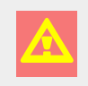
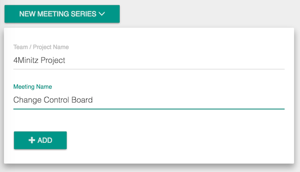
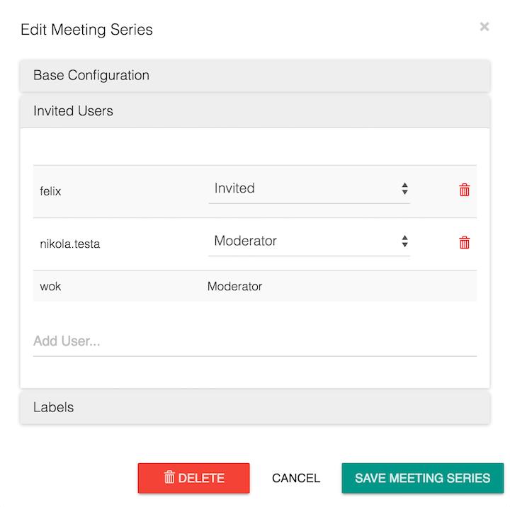
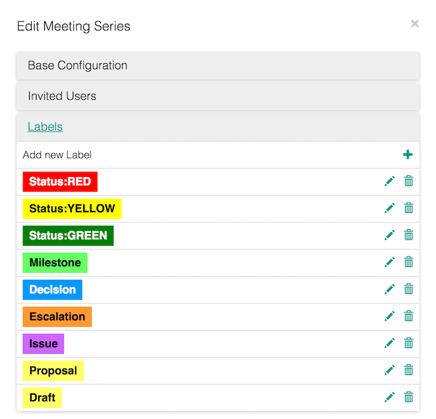
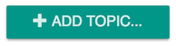
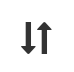
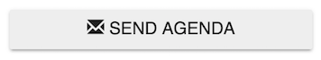
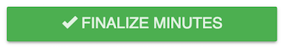
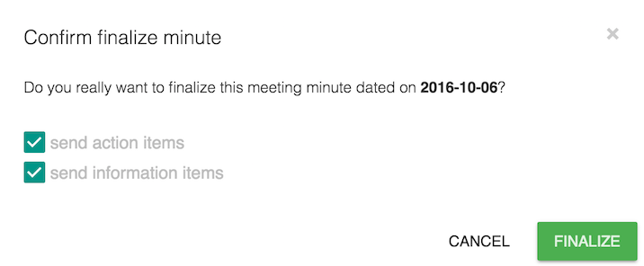

# 4Minitz User Manual

## Important Hint
4Minitz is a client-server webapp. So the client needs the server to permanently store your meeting minutes. Nevertheless the meteor framework allows the client webapp to temporarily work 'offline' and sync the contents as soon as the server is available again.

4Minitz shows a warning icon in the top-right of your browser window to show the "Connection Lost" state:

In this state you can hover the mouse over the icon to get information about how long the connection is lost and how often the client retried to re-conect. You may click on the warning icon to foce an immediate reconnect.
 
 **Important:** If you see the above waning icon and you close your webbrowser, or close the tab where 4Minitz is loaded, or if you enter a different URL in the address bar - **You will lose all your unsaved changes!**
 
 So, unless you intentionally work offline, you should stop adding content to 4Minitz and instead check your web browsers internet connection or clarify with a system administrator, why the 4Minitz client lost connection to the 4Minitz server.

## Register an Account
If your local installation of 4Minitz allows login via LDAP, you never need to register an account with 4Minitz. In this case just switch to the LDAP login screen and enter username and LDAP password.

If your local installation has no LDAP configured, or you are using our demo server at http://www.4minitz.com, you may click on "Register" to create a new user. The E-Mail you enter will be used to send meeting minutes or action items to you.

## Create a Meeting Series
A meeting series comprises of a project name and a meeting name.
Minutes have to be added to an existing meeting series.

If you create a new meeting series, you will automatically become a moderator of this meeting series.

 
If you are a moderator of a meeting series you can... 

* invite users. Only invited users can see your meeting series.
* uninvite users
* promote users to the moderator role of this meeting series
* unpromote users from moderator role to normal invited status

After you press the "+ Add" button in the above dialog, 4Minitz will automatically open the "Meeting Series Properties Editor". Here you can invite other users to your meeting series. For more details see next chapter.

## Edit Meeting Series Properties
On the 4Minitz start page you will see all meeting series that are visible for you. A "person" icon behind a meetign series name means that you are moderator of this series.

If you click on the name of a meeting series, you will see the meeting series details with all existing meeting minutes dates (this list is initially empty, of course).

On the meeting series screen you may click the cog to open the meeting series editor. The icon is only visible for moderators of the series.

The meeting series editor allows a moderator to
 
 * Change project/team name or meeting name of the series
 * Invite, uninvite, promote users
 * Change available labels (aka tags) for this meeting series
 
 
 
 *Note: Changes to invited users of a meeting series will be propagated to all existing and future meeting minutes of this series.*
 
 
  
 *Note: Changes to the labels will only take effect for meeting minutes that are created afterwards. Existing minutes are not changed by the meeting series properties editor.*

 
 
## Add New Minutes to a Meeting Series
As a moderator you may create new minutes for an existing meeting series by clicking the "+ Create New Minutes" button.

## Prepare a Meeting
In preparation to a meeting the moderator can add topics to the current meeting minutes by clicking the button:

New topics will always be inserted at the top if the list.

If the moderator wants to change the order of the topic it is possible to drag'n'drop topics on the "up-down-arrow" handle:

The icons on a topic allow the following operations:

* **"Plus"** will add a **child item** to the topic. This feature will be described in the chapter "Take Meeting Minutes".
* **"Circle Arrow"** will switch the topic to a **recurring topic** that will be part of any future meetings
* **"Pen"** will allow the moderator to *edit this topic's** subject or the responsible
* **"Trash"** will **delete** this topic after a security question
* **"Up-Down-Arrow"** allows reordering the topics via **drag'n'drop**

## Send Agenda to Participants
All open topics of the current meeting minutes will be send by EMail to all invited users (and moderators) of the current meeting series if the moderator clicks the button:

## Take Meeting Minutes
During a meeting a moderator may add
* child **Information Items** to topics and
* child **Action Items** to topics

by clicking the "Plus" icon on a topic.
 
### Information Items
Information Items are children of topics and will be sent as part of the meeting protocol to all invited users on finalze.

Information items will not be propagated to the next meeting unless the "pinned state" is switched on **and** the parent topic is propagated to the next meeting:
 
 Unpinned state. Click to pin
 
 Pinned state. Click to unpin

For details on when topics are propagated to the next meeting see the "Finalze Meeting" chapter. 

The icons on an info item allow the following operations:

* **"Plus"** will **add details** to the item. This feature will be described in the chapter "Adding Details".
* **"Pin"** will switch the topic to a **as pinned topic** that will be propagated to the next meeting, of the parent topic is also propagated
* **"Pen"** will allow the moderator to *edit this items** details
* **"Trash"** will **delete** this item after a security question
  
 
### Action Items
Action Items are children of topics and will be sent only to the entered responsible(s) on finalze of the meeting minutes.

An action item will be propagated together with its parent topic to the next meeting unless the action item is checked as "done".

The icons on an action item allow the following operations:

* **"Plus"** will **add details** to the item. This feature will be described in the chapter "Adding Details".
* **"Pen"** will allow the moderator to *edit this items** details
* **"Trash"** will **delete** this item after a security question  

### Adding Details
By clicking the "Plus" icon on Information Items and Action Items it is possible to add details to them.

In the details editor it is possible to use markdown syntax to create rich text formatting like headings, bold, italic, bullet lists, etc.

## Finalize Meeting

* TODO: Topic Propagation

## Print Meeting Minutes
TODO

## Unfinalize Meeting
TODO
