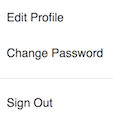
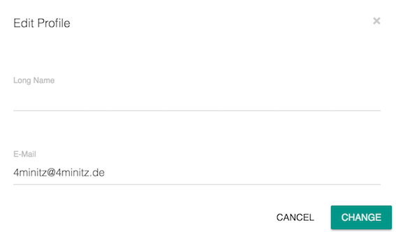
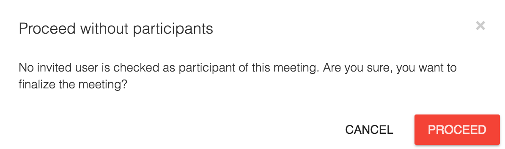
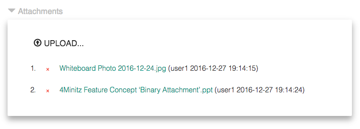
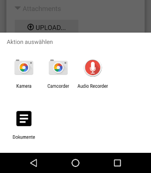
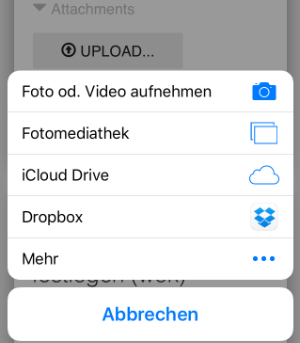
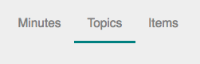
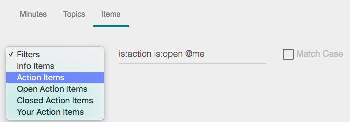

# 4Minitz User Manual

## Important Hint
4Minitz is a client-server webapp. So the client needs the server to permanently store your meeting minutes. Nevertheless the meteor framework allows the client webapp to temporarily work 'offline' and sync the contents as soon as the server is available again.

4Minitz shows a warning icon in the top-right of your browser window to show the "Connection Lost" state:

In this state you can hover the mouse over the icon to get information about how long the connection is lost and how often the client retried to re-connect. You may click on the warning icon to force an immediate reconnect.
 
 **Important:** If you see the above waning icon and you close your webbrowser, or close the tab where 4Minitz is loaded, or if you enter a different URL in the address bar - **You will lose all your unsaved changes!**
 
 So, unless you intentionally work offline, you should stop adding content to 4Minitz and instead check your web browsers internet connection or clarify with a system administrator, why the 4Minitz client lost connection to the 4Minitz server.

## Register an Account
If your local installation of 4Minitz allows login via LDAP, you never need to register an account with 4Minitz. In this case just switch to the LDAP login screen and enter username and LDAP password.

If your local installation has no LDAP configured, or you are using our demo server at http://www.4minitz.com, you may click on "Register" to create a new user. The E-Mail you enter will be used to send meeting minutes or action items to you.

## Edit Profile

If you are a non-LDAP user, you can edit your profile by clicking the button "Edit Profile":

You can change your:
 * long name ()
 * E-Mail address (required) 
 

## Create a Meeting Series
A meeting series comprises of a project name and a meeting name.
Minutes have to be added to an existing meeting series.

If you create a new meeting series, you will automatically become a moderator of this meeting series.

 
If you are a moderator of a meeting series you can... 

* invite users. Only invited users can see your meeting series.
* uninvite users
* promote users to the moderator role of this meeting series
* unpromote users from moderator role to normal invited status
* specify who is informed

After you press the "+ Add" button in the above dialog, 4Minitz will automatically open the "Meeting Series Properties Editor". Here you can invite other users to your meeting series. For more details see next chapter.

## Edit Meeting Series Properties
On the 4Minitz start page you will see all meeting series that are visible for you. A "person" icon behind a meeting series name means that you are moderator of this series.

If you click on the name of a meeting series, you will see the meeting series details with all existing meeting minutes dates (this list is initially empty, of course).

On the meeting series screen you may click the cog to open the meeting series editor. The icon is only visible for moderators of the series.

The meeting series editor allows a moderator to
 
 * Change project/team name or meeting name of the series
 * Invite, uninvite, promote users
 * Change available labels (aka tags) for this meeting series
 
 
 
 *Note: Changes to invited users of a meeting series will only be propagated future meeting minutes of this series.*

 ### Table of Roles and Rights
 | Role          | Gets EMail   | May Read    | May Upload |   May Edit/Finalize   |
 | ------------- |:------------:|:-----------:|:-----------:|:-------------:|
 | Moderator     | Yes          | Yes         |     Yes     | Yes         |
 | Uploader      | Yes          | Yes         |     Yes     | No          |
 | Invited       | Yes          | Yes         |     No      | No          |
 | Informed      | Yes          | No          |     No      | No          |
 | Others        | No           | No          |  No         | No ;-)      |

 * The 'Informed' user only gets the final meeting minutes protocol email.
   But not the agenda email.
 
 
  
 *Note: Changes to the labels will only take effect for meeting minutes that are created afterwards. Existing minutes are not changed by the meeting series properties editor.*

 
 
## Add New Minutes to a Meeting Series
As a moderator you may create new minutes for an existing meeting series by clicking the "+ Create New Minutes" button.

## Prepare a Meeting
In preparation to a meeting the moderator can add topics to the current meeting minutes by clicking the button:

New topics will always be inserted at the top if the list.

If the moderator wants to change the order of the topic it is possible to drag'n'drop topics on the "up-down-arrow" handle:

The icons on a topic allow the following operations:

* **"Plus"** will add a **child item** to the topic. This feature will be described in the chapter "Take Meeting Minutes".
* **"Circle Arrow"** will switch the topic to a **recurring topic** that will be part of any future meetings
* **Click on title text** will allow the moderator to *edit this topic's** subject or the responsible
* **"Trash"** will **delete** this topic after a security question
* **"Up-Down-Arrow"** allows reordering the topics via **drag'n'drop**

## Send Agenda to Participants
All open topics of the current meeting minutes will be send by EMail to all invited users (and moderators) of the current meeting series if the moderator clicks the button:

The agenda will *not* be sent to "informed" users.

## Take Meeting Minutes
During a meeting a moderator may add
* child **Information Items** to topics and
* child **Action Items** to topics

by clicking the "Plus" icon on a topic.
 
### Information Items
Information Items are children of topics and will be sent as part of the meeting protocol to all invited users on finalize.

Information items will not be propagated to the next meeting unless the "pinned state" is switched on **and** the parent topic is propagated to the next meeting:
 
 Unpinned state. Click to pin
 
 Pinned state. Click to unpin

For details on when topics are propagated to the next meeting see the "Finalize Meeting" chapter. 

The icons on an info item allow the following operations:

* **"Plus"** will **add details** to the item. This feature will be described in the chapter "Adding Details".
* **"Pin"** will switch the topic to a **as pinned topic** that will be propagated to the next meeting, of the parent topic is also propagated
* **Click on title text** will allow the moderator to *edit this items** details
* **"Trash"** will **delete** this item after a security question
  
 
### Action Items
Action Items are children of topics and will be sent only to the entered responsible(s) on finalize of the meeting minutes.

An action item will be propagated together with its parent topic to the next meeting unless the action item is checked as "done".

The icons on an action item allow the following operations:

* **"Plus"** will **add details** to the item. This feature will be described in the chapter "Adding Details".
* **Click on title text** will allow the moderator to *edit this items** details
* **"Trash"** will **delete** this item after a security question  

### Adding Details
By clicking the "Plus" icon on Information Items and Action Items it is possible to add details to them.

In the details editor it is possible to use markdown syntax to create rich text formatting like headings, bold, italic, bullet lists, etc.

### Expand and Collapse
TODO

## Finalize Meeting

Make sure you haven't forgotten to select participants before finalizing the Minutes. A warning message will be shown, if no participants are selected. You can cancel finalizing and add them or confirm ans proceed without 
participants:

* TODO: Topic Propagation
* TODO: Finalize history

## Print Meeting Minutes
With the button "Print Minutes" temporary some view changes are performed for the current minutes like
* All buttons are hidden
* Checkboxes are switched to a printable version
* All topics, info items, action items and details are expanded

Afterwards your systems print dialog is opened.

**Hint:** Via the print functionality you may print the current minutes to a PDF and archive this file in a separate document management software.

## Unfinalize Meeting
The latest finalized meeting minutes can be un-finalized to make corrections / changes to the already finalized minutes. Simply press the "Pen" button next to the finalize time stamp:

Once the moderator creates new minutes on top of the finalized last minutes, it is not possible to un-finalized the last finalized minutes anymore.

## Upload Binary Attachments
It is possible to attach binary uploads to the current non-finalized
meeting minutes. You need to have the moderator or the uploader role 
for the current meeting series to do so. 

To upload a file, expand the 'Attachments' section by
clicking on the triangle. Then click the "UPLOAD" button to open
 a file selection dialog. Select your local file and press "OK".

Your server admin may have specified a maximum file size or denied /
allowed file extensions. Your client will show an error, if the 
current file is not allowed. If you are not happy with the settings,
talk to your admin.

**Did you know?** If you click the Upload button not only 
on your desktop, but also on your *smartphone or tablet*. 
This will present a dialog where you can take a photo with the devices
camera that will be uploaded afterwards. Very handy for snapshots of
white boards that where filled during meetings.

During the attachment upload a progress bar will show how long 
the upload will take. The progress bar has buttons to pause, 
continue or cancel the upload.

If you are the *moderator* of the meeting series, you may remove
every attachment of an un-finalized meeting minutes by clicking
the small red cross "X" in front of the attachment name.
If you have the uploader role you may only remove your own uploaded
attachments from non-finalized meeting minutes.

Currently attachments will not be attached to the sent meeting
minutes EMail. The recipient will have to open the meeting minutes
in the webbrowser first, to open an attachment by clicking the name.

### Roles and Rights for Attachments

| Role          | May Upload     |  May Remove |   May Download   |
| ------------- |:--------------:| :-------------:|:-------------:|
| Moderator     | Yes            |       Yes      | Yes           |
| Uploader      | Yes            | Only her own!  | Yes           |
| Invited       | No             |        No      | Yes           |
| Informed      | No             |        No      | No            |
| Others        | No             |        No      | No ;-)        |

## Search through topics, info items and action items

Sometimes one want to dig out, when a certain decision was made
 or who was responsible for a specific action item. In this case
 you can head over to the meeting series overview and use the tabs
 called "Topics" and "Items".
 

  
On these tabs you get a list of all topics or items that where ever part of finalized meeting minutes. Above the list you have a
  powerful filter bar:
  

  
In the filter bar you can enter any text that is searched in the topics / items. Here are some hints:
  
* Search is case in-sensitive by default. You can switch on the "Match Case" to make search case sensitive
* Multiple search terms are combined with a logical "AND". So only documents are filtered that match all of your terms and attributes

* The following attributes can be used in **All Filters**:
  * `do:match-case` - perform a case sensitive search
  * `@me` - find all topics, info items or action items that are assigned to me
  * `@John` - find topics / items assigned to "John"
  * `@John @Doe` - find topics / items assigned to "John Doe" 
  * `\#Decision` - find topics / items with this label

* The following attributes can be used in the **Topic Filter**:
  * `is:open` - find open topics
  * `is:closed` - find closed topics
  
* The following attributes can be used in the **Item Filter**:
  * `is:action` - find only action items 
  * `is:info` - find only info items
  * `is:open` - find open action items
  * `is:closed` -  find closed action items
