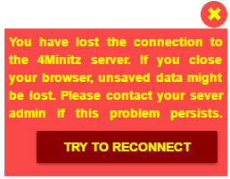
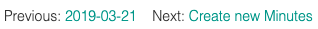
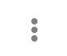
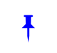
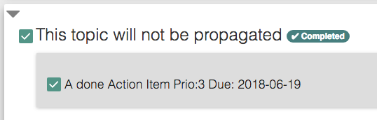
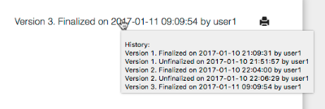
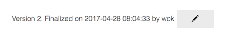
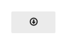
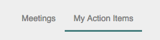

# 4Minitz User Manual

**Be sure to also read our [User FAQ](../faq.md)**

## Table of Content
<!-- HowTo update table of content -->
<!--    npm install --save markdown-toc -->
<!--    markdown-toc -i --maxdepth 2 usermanual.md -->

<!-- toc -->

- [Important Hint](#important-hint)
- [Register an Account](#register-an-account)
- [Edit Profile / Change Password](#edit-profile--change-password)
- [Create a Meeting Series](#create-a-meeting-series)
- [Edit Meeting Series Properties](#edit-meeting-series-properties)
- [Add New Minutes to a Meeting Series](#add-new-minutes-to-a-meeting-series)
- [Prepare a Meeting](#prepare-a-meeting)
- [Send Agenda to Participants](#send-agenda-to-participants)
- [Take Meeting Minutes](#take-meeting-minutes)
- [Finalize Meeting](#finalize-meeting)
- [Print Meeting Minutes](#print-meeting-minutes)
- [Unfinalize Meeting](#unfinalize-meeting)
- [Download minute protocols](#download-minute-protocols)
- [Upload Binary Attachments](#upload-binary-attachments)
- [Search through topics, info items and action items](#search-through-topics-info-items-and-action-items)

<!-- tocstop -->

## Important Hint
4Minitz is a client-server webapp. So the client needs the server to permanently store your meeting minutes. Nevertheless the meteor framework allows the client webapp to temporarily work 'offline' and sync the contents as soon as the server is available again.

4Minitz shows a warning message in the top-right of your browser window to show the "Connection Lost" state:

In this state you can hover the mouse over the top icon to get information about how long the connection is lost and how often the client retried to re-connect. You may click on the button "try to reconnect" to force an immediate reconnect.

 **Important:** If you see the above waning and you close your webbrowser, or close the tab where 4Minitz is loaded, or if you enter a different URL in the address bar - **You will lose all your unsaved changes!**

 So, unless you intentionally work offline, you should stop adding content to 4Minitz and instead check your web browsers internet connection or clarify with a system administrator, why the 4Minitz client lost connection to the 4Minitz server.

## Register an Account
If your local installation of 4Minitz allows login via LDAP, you never need to register an account with 4Minitz. In this case just switch to the LDAP login screen and enter username and LDAP password.

If your local installation has no LDAP configured, or you are using our demo server at http://www.4minitz.com, you may click on "Register" to create a new user. The E-Mail you enter will be used to send meeting minutes or action items to you.

## Edit Profile / Change Password
In the user menu you might change various user settings.

E.g. you might change the language of the the user interface.
Per default 4Minitz will ask your browser for the preferred language.
If you don't like that default select "Set Language" from the user menu and change to the language locale of your choice.
If you are not the demo user, your new language preference is persisted in your user profile.

If you are a non-LDAP user, you can edit your profile by clicking the button "Edit Profile" or "Change Password":

You can change your:
 * long name ()
 * E-Mail address (required)

## Create a Meeting Series
A meeting series comprises of a project name and a meeting name.
Minutes have to be added to an existing meeting series.

If you create a new meeting series, you will automatically become a moderator of this meeting series.

If you are a moderator of a meeting series you can...

* invite users. Only invited users can see your meeting series.
* uninvite users
* promote users to the moderator role of this meeting series
* unpromote users from moderator role to normal invited status
* specify who is informed

After you press the "+ Add" button in the above dialog, 4Minitz will automatically open the "Meeting Series Properties Editor". Here you can invite other users to your meeting series. For more details see next chapter.

## Edit Meeting Series Properties
On the 4Minitz start page you will see all meeting series that are visible for you. A "person" icon behind a meeting series name means that you are moderator of this series.

If you click on the name of a meeting series, you will see the meeting series details with all existing meeting minutes dates (this list is initially empty, of course).

On the meeting series screen you may click the cog to open the meeting series editor. The icon is only visible for moderators of the series.

The meeting series editor allows a moderator to

 * Change project/team name or meeting name of the series
 * Invite, uninvite, promote users
 * Change available labels (aka tags) for this meeting series

 

 *Note: Changes to invited users of a meeting series will only be propagated future meeting minutes of this series.*

 ### Table of Roles and Rights
 | Role          | Gets EMail   | May Read    | May Upload |   May Edit/Finalize   |
 | ------------- |:------------:|:-----------:|:-----------:|:-------------:|
 | Moderator     | Yes          | Yes         |     Yes     | Yes         |
 | Uploader      | Yes          | Yes         |     Yes     | No          |
 | Invited       | Yes          | Yes         |     No      | No          |
 | Informed      | Yes          | No          |     No      | No          |
 | "None"        | No           | No          |  No         | No ;-)      |

 * The 'Informed' user only gets the final meeting minutes protocol email.
   But not the agenda email.

 

 *Note: Changes to the labels will only take effect for meeting minutes that are created afterwards. Existing minutes are not changed by the meeting series properties editor.*

## Add New Minutes to a Meeting Series
As a moderator you may create new minutes for an existing meeting series by clicking the "+ Create New Minutes" button.

### Create New Minutes from finalized minutes
As a moderator, if the minutes is finalized and is the last minutes of the meeting series then you can directly
 create new minutes by clicking on the link "Create New Minutes" on the finalized minutes page.

## Prepare a Meeting
In preparation to a meeting the moderator can add topics to the current meeting minutes by clicking the button:

New topics will always be inserted at the top if the list.

If the moderator wants to change the order of the topic it is possible to drag'n'drop topics on the "up-down-arrow" handle:

If you click the "three dots" menu icon

the topic menu will allow you to:

* **"Add Info Item"** will add a info item to the topic. An information item is information that is going to be published with your meeting minutes to all invited persons. This feature will be described in the chapter "Take Meeting Minutes"
* **"Add Action Item"** will add an action item to the topic. An action item is a ToDo that is sent to its responsible. This feature will be described in the chapter "Take Meeting Minutes"
* **"Edit Topic"** (or click on topic subject text) will allow the moderator to edit this topic's subject, label or the responsible
* **"Set Recurring"** will switch the topic to a recurring topic that will be part of any future meetings
* **"Set Skip"** will mark a topic as to be skipped. Skipped topics will not be part of the current minute and are hidden for everyone except the moderator. In the next minute a skipped topic will automatically appear as normal.
* **"Show History"** If the topic was ever finalized in previous meeting minutes,
 this will show the finalized topic content as it is stored in the
 meeting series. Here you are able to see closed action items of the topic
 or historical info items that are not any longer visible in the current
 meeting minutes.
* **"Delete Topic"** will delete this topic after a security question
* **"Up-Down-Arrow"** allows reordering the topics via drag'n'drop

There is also a "three dots" menu icon within the meeting series' overview of topics.
This menu is available for already closed Topics and contains the menu entry **"Re-open Topics"**. By using this feature the topic will be opened again and will occur in the next minute respectively the current one, if it is not finished yet.

### The Global Notes of a Meeting
The global notes allow you to write down some stuff that does
not belong to a specifi topic, but concerns the meeting as a whole.
Examples might be: *"Kick-off for project XYZ"* or *"First meeting with Alex"*

The global notes will be send with Agenda mail and Finalize mail to invited and informed users.

There might also be situations where you want to have the global note to have equal content between meetings. In this case click the small pin needle above the global note to make it sticky and propagate to the next meeting. Examples for this situation might be: *"Meeting Time: 8:00-10:00 CET in Room '101'"* or *"Meeting Rules: No Phones, No Laptops"*

## Send Agenda to Participants
All open (non skipped) topics of the current meeting minutes will be send by EMail to all invited users (and moderators) of the current meeting series if the moderator clicks the button:

The agenda will *not* be sent to "informed" users.

## Take Meeting Minutes
During a meeting a moderator may add
* child **Information Items** to topics and
* child **Action Items** to topics

by clicking the corresponding menu entry on the topic "three dot" menu.

### Information Items
Information Items are children of topics and will be sent as part of the meeting protocol to all invited users on finalize.

Information items will not be propagated to the next meeting unless the "pinned state" is switched on **and** the parent topic is propagated to the next meeting:

 Unpinned state. Click to pin

 Pinned state. Click to unpin

For details on when topics are propagated to the next meeting see the "Finalize Meeting" chapter.

The menu entries in the "three dot" info item menu allow the following operations:

* **"Add Details"** will add details to the item. This feature will be described in the chapter "Adding Details".
* **"Edit Item"** will allow the moderator to edit this items properties (like subject, label)
* **"Convert to Action"** will convert this info item to an action item. But only possible for new items!
* **"Set Pinned"** will switch the topic to a pinned topic that will be propagated to the next meeting, if the parent topic is also propagated
* **"Delete Item"** will delete this item after a security question. Info Items from previous meeting can not be deleted - they can only be set to "unpinned" state. So you will get rid of them in the next meeting.

### Action Items
Action Items are children of topics and will be sent to the entered responsible(s) in a separate mail when the moderator finalizes the meeting minutes.

An action item will be propagated together with its parent topic to the next meeting unless the action item is checked as "done".

The color of the action items background gives the following information:
* green: normal open action item
* yellow: the action item is due TODAY
* red: the action item is over due
* grey: the action item is closed

The menu entries in the "three dot" action item menu allow the following operations:

* **"Add Details"** will add details to the item. This feature will be described in the chapter "Adding Details".
* **"Edit Item"** will allow the moderator to edit this action items properties (like subject, label, responsible)
* **"Convert to Info"** will convert this action item to an info item. But only possible for new items!
* **"Delete Item"** will delete this item after a security question. Action Items from a previous meeting can not be deleted - they can only be set to "done". So you will get rid of them in the next meeting.

### Adding Details
Details can be added directly in the dialog of new Information Items and Action Items.

If the Item already exists it is possible to add details to them by clicking the "Add Details" menu on Information Items and Action Items.

In the details editor it is possible to use markdown syntax to create rich text formatting like headings, bold, italic, bullet lists, etc.

For a complete reference of layout commands see [Markdown Reference](https://guides.github.com/features/mastering-markdown/).

### Expand and Collapse
Little triangles in the upper left corner of e.g., topics, info items and action items show that there is content below that can be expanded or collapsed.

## Finalize Meeting

Select participants that were present before finalizing the Minute. You can use the "Mark all" checkbox for your convenience.

Make sure you haven't forgotten to select participants before finalizing the Minutes. A warning message will be shown, if no participants are selected. You can cancel finalizing and add them or confirm and proceed without
participants:

### Topic Propagation
**Attention! Here comes one of the "Killer Features"...  ;-)**

A topic is automatically propagated to the next meeting if one of the following conditions is met:
  1. the topic is **not "checked"** as "dicussed for this meeting" - or
  1. the topic is **marked as "recurring"** with the blue circle icon - or
  1. the topic has at least one **open action item** which is not checked as done.

Contrary, a topic that is "finally completed" is marked with an automatic
"Completed" label to give a visual clue that it will **not**
be propagated to the next meeting.

So, such a "finally completed" topic...
  1. is checked as dicussed in the current meeting - and
  1. has no open action items - and
  1. is not marked as recurring

### Finalize history
Inside the meeting minute hover over this (example) text:
`Version 3. Finalized on 2017-01-11 09:09:54 by user1` and you'll see
the finalize history for every version of the protocol:

 

## Print Meeting Minutes
With the button "Print Minutes" temporary some view changes are performed for the current minutes like
* All buttons are hidden
* Checkboxes are switched to a printable version
* All topics, info items, action items and details are expanded

Afterwards your systems print dialog is opened.

**Hint:** Via the print functionality you may print the current minutes to a PDF and archive this file in a separate document management software.

## Unfinalize Meeting
The latest finalized meeting minutes can be un-finalized to make corrections / changes to the already finalized minutes. Simply press the **"Pen" button** next to the finalize time stamp:

Once the moderator creates new minutes on top of the finalized last minutes, it is not possible to un-finalize the last finalized minutes anymore.

## Download minute protocols
The app offers the possibility of automatic generation of minute protocols by finalizing them. This applies only if this feature has been enabled by the admin in the settings. Depending on the setting the download format will be HTML or PDF or even PDF/A.

These protocols can  be downloaded by any user having the invited role or a higher higher for the specific meeting series.
In order to do this, press the download button in the upper right corner shown in finalized minutes.

If the feature is enabled but no protocol has been created for a specific minute (e.g. if the feature has been enabled after finalizing a minute) then by clicking on the download button a confirmation dialog opens. It will offer you to download an dynamically generated HTML protocol as a substitution. This protocol will not be stored on the server.

## Upload Binary Attachments
It is possible to attach binary uploads to the current non-finalized
meeting minutes. You need to have the moderator or the uploader role
for the current meeting series to do so.

To upload a file, expand the 'Attachments' section by
clicking on the triangle. Then click the "UPLOAD" button to open
 a file selection dialog. Select your local file and press "OK".

Your server admin may have specified a maximum file size or denied /
allowed file extensions. Your client will show an error, if the
current file is not allowed. If you are not happy with the settings,
talk to your admin.

**Did you know?** If you click the Upload button not only
on your desktop, but also on your *smartphone or tablet*.
This will present a dialog where you can take a photo with the devices
camera that will be uploaded afterwards. Very handy for snapshots of
white boards that where filled during meetings.

During the attachment upload a progress bar will show how long
the upload will take. The progress bar has buttons to pause,
continue or cancel the upload.

If you are the *moderator* of the meeting series, you may remove
every attachment of an un-finalized meeting minutes by clicking
the small red cross "X" in front of the attachment name.
If you have the uploader role you may only remove your own uploaded
attachments from non-finalized meeting minutes.

Currently attachments will not be attached to the sent meeting
minutes EMail. The recipient will have to open the meeting minutes
in the web browser first, to open an attachment by clicking the name.

### Roles and Rights for Attachments

| Role          | May Upload     |  May Remove |   May Download   |
| ------------- |:--------------:| :-------------:|:-------------:|
| Moderator     | Yes            |       Yes      | Yes           |
| Uploader      | Yes            | Only her own!  | Yes           |
| Invited       | No             |        No      | Yes           |
| Informed      | No             |        No      | No            |
| "None"        | No             |        No      | No ;-)        |

## Search through topics, info items and action items

Sometimes one want to dig out, when a certain decision was made
 or who was responsible for a specific action item. In this case
 you can head over to the meeting series overview and use the tabs
 called "Topics" and "Items".

On these tabs you get a list of all topics or items that where ever part of finalized meeting minutes. Above the list you have a
  powerful filter bar:

In the filter bar you can enter any text that is searched in the topics / items. Here are some hints:

* Search is case in-sensitive by default. You can switch on the "Match Case" to make search case sensitive
* Multiple search terms are combined with a logical "AND". So only documents are filtered that match all of your terms and attributes

* The following attributes can be used in **All Filters**:
  * `do:match-case` - perform a case sensitive search
  * `@me` - find all topics, info items or action items that are assigned to me
  * `@John` - find topics / items assigned to "John"
  * `@John @Doe` - find topics / items assigned to "John Doe"
  * `\#Decision` - find topics / items with this label

* The following attributes can be used in the **Topic Filter**:
  * `is:open` - find open topics
  * `is:closed` - find closed topics

* The following attributes can be used in the **Item Filter**:
  * `is:action` - find only action items
  * `is:info` - find only info items
  * `is:open` - find open action items
  * `is:closed` -  find closed action items

On the tab "Items" sometimes you wish to see the context (parent) topic of a specific item. For this simply click on the "Show Topic" link of an item.

## My Action Items
If you are invited to multiple meeting series, it might happen that you get quite some action items from different meetings. To keep the overview of what is expected from you to do and what are the due dates, you may go to the "My Action Items" tab on the start screen of 4Minitz.

All action items on this tab are
* marked for YOU as responsible
* still open (default view)
* sorted by due date

You may also filter to see closed action items or action items with a specific text.

Sometimes the action item is not understandable without the parent topic context where the action item stems from. So, it is possible to navigate from an action item on the "My Action Items" tab to the parent topic by clicking "Show Topic". On this view press the "Go Back" button to navigate back to the "My Action Items" tab.
