# Manual I18N Checklist

The following file lists most of the Ui visible Text with pre-conditions how to make
them visible on the screen.
For
* Whole screens
* Menues
* Dialogs
* Error/Warning/Info Messages

The idea is: when a new language is introduced to I18N / NLS then the
below preconditions can be created, and then the user interface can be checked if the
expexted content now shows up in the new translated language.

## 001-Screen.Login

Precondition:

* No user logged in

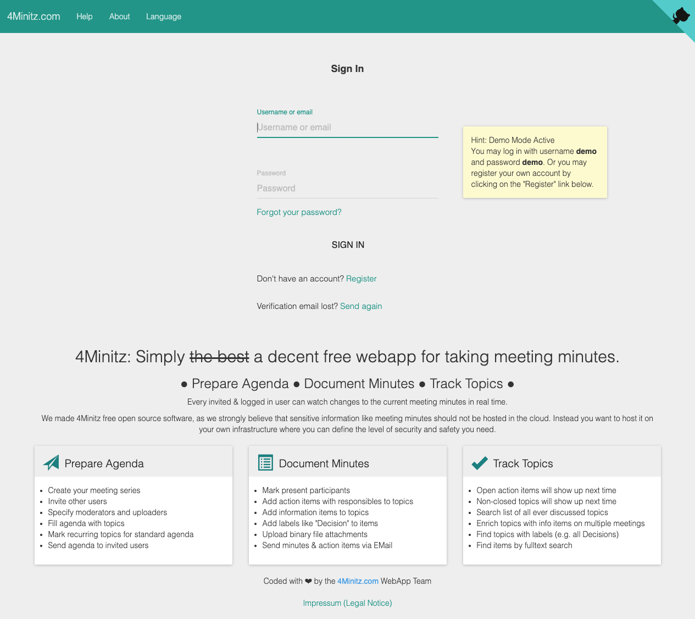

## 001.1-Dlg.About.png

Precondition:

* Clicked main menu 'About'

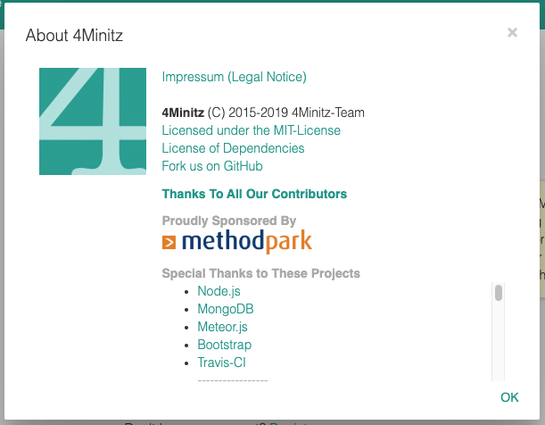

## 001.1-Dlg.About-Stats.png

Precondition:

* Clicked main menu 'About'
* Clicked on 4Minitz icon to open statistics

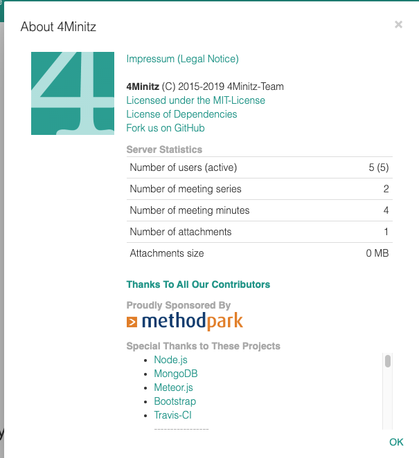

## 001.2-Msg.LoginError.png

Precondition:

* No user logged in
* Wrong login credentials

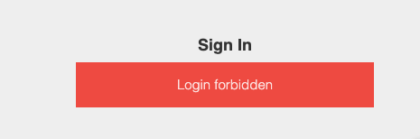

## 001.2-Screen.CreateAccount.png

Precondition:

* No user logged in
* Click 'Register' new user

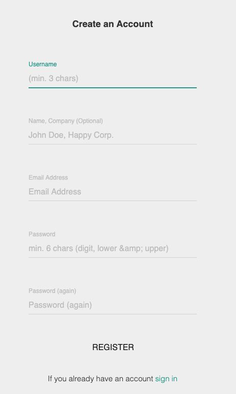

## 001.2-Screen.ResendVerification.png

Precondition:

* No user logged in
* Click 'Resend' Verification Mail

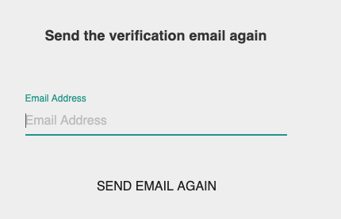

## 001.2-Screen.ResetPassword.png

Precondition:

* No user logged in
* Click 'Forgot Your Password'

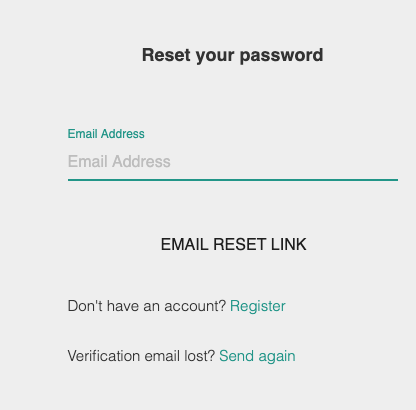

## 001.3-Screen.LegalNotice.png

Precondition:

* Click 'Impressum / Legal Notice'
* Hint: Only OK-Button needs translation. Legal Notice is controlled via settings.json by admin

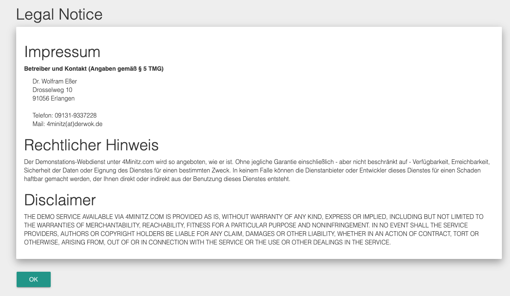

## 002.1-Dlg.ChangePassword.png

Precondition:

* User menu: Change Password

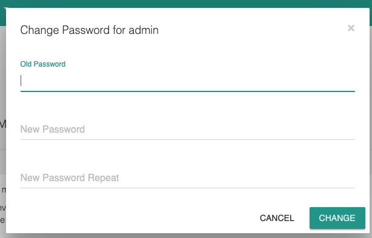

## 002.1-Dlg.EditProfile.png

Precondition:

* User Menu: Edit Profile

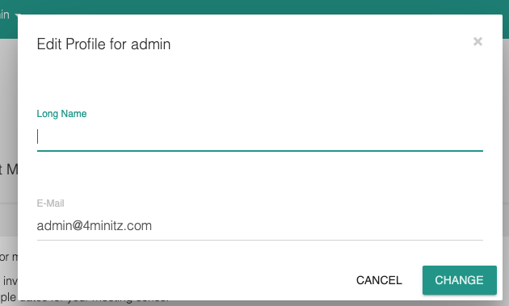

## 002.1-Msg.EditProfileFlashmessage.png

Precondition:

* User Menu: Edit Profile
* Make some changes
* Press OK

## 002.1-Msg.EditProfileConfirmReverifyEMail.png

Precondition:

* Ensure, settings.json has EMail verifiation set
* User Menu: Edit Profile
* Change mail address
* Press OK

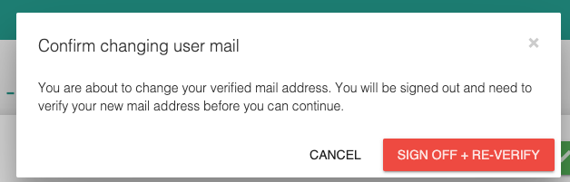

## 002.1-Dlg.SetLanguage.png

Precondition:

* User menu: Set Language

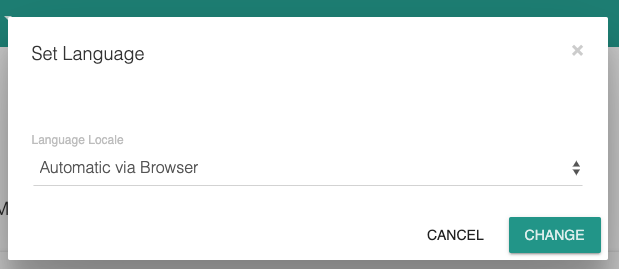

## 002.1-Menu.Usermenu.png

Precondition:

* User is not admin
* Open user menu

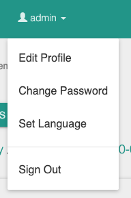

## 002.1-Menu.Adminmenu.png

Precondition:

* User is admin User
* Open User menu

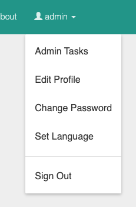

## 003.0-Dlg.NewMeetingSeries.png

Precondition:

* On main screen
* Click Button 'New Meeting Series'

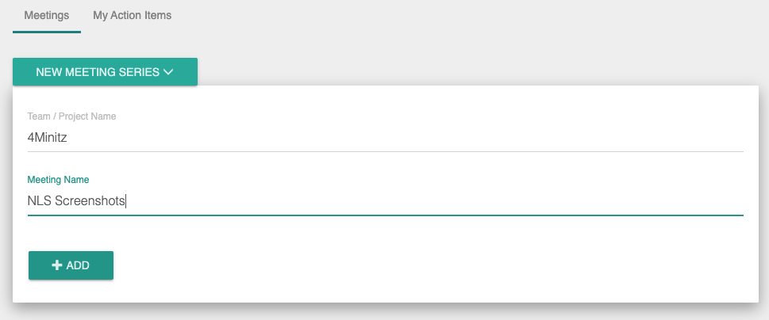

## 003.1-Dlg.EditMeetingSeries-Base.png

Precondition:

* Just created new meeting series
* Click on tab 'Base Configuration'

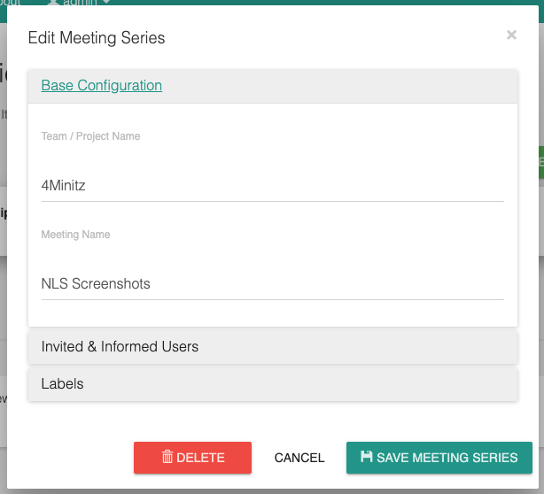

## 003.1-Dlg.EditMeetingSeries-Labels.png

Precondition:

* Just created new meeting series
* Click on tab 'Labels'

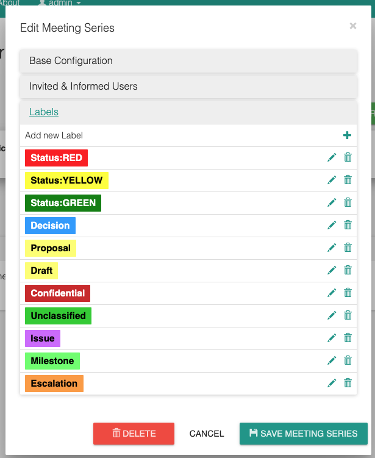

## 003.1-Dlg.EditMeetingSeries-Users.png

Precondition:

* Just created new meeting series
* Click on tab 'Invited and Informed Users'

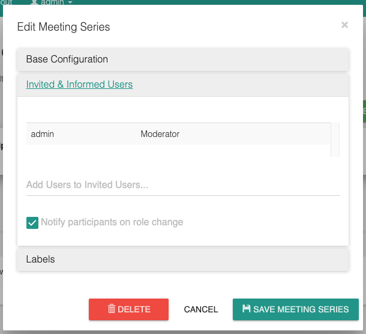

## 003.1-Dlg.EditMeetingSeries-UsersRole.png

Precondition:

* Just created new meeting series
* Click on tab 'Invited and Informed Users'
* Add a new user
* Change role of user

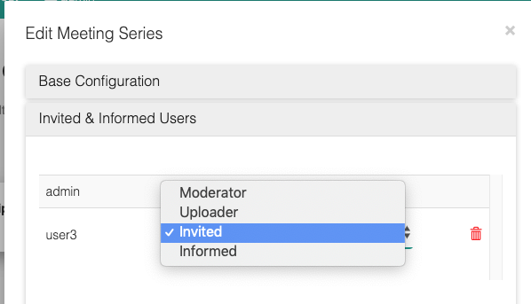

## 003.1-Msg.EditSoftLock.png

Precondition:

* Open 4Minitz in two different browsers
* In each browser login as different user
* User#1 'Edit Meeting Series'
* User#2 try to 'Edit Meeting Series'

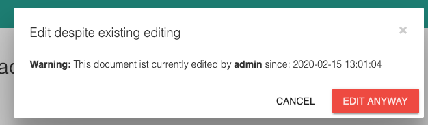

## 003.1-Screen.Meetings.png

Precondition:

* Create a meeting series with one meeting

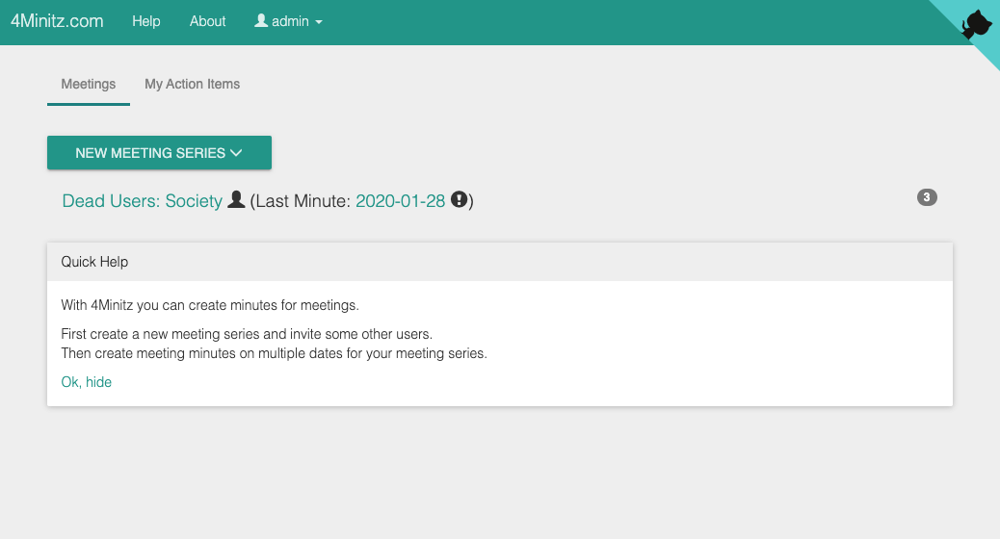

## 003.2-Screen.MyActionItems.png

Precondition:

* Create meeting series with one meeting minute
* Inside meeting minute create one action item for current user

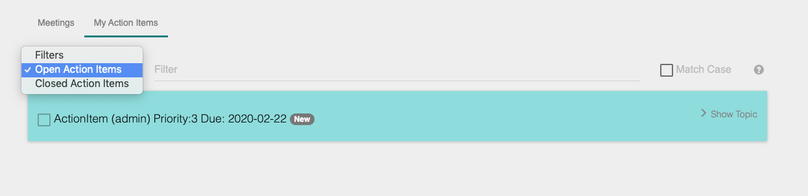

## 003.2-Screen.MyActionItemsFilter.png

Precondition:

* On 'My Action Item' tab open item filters

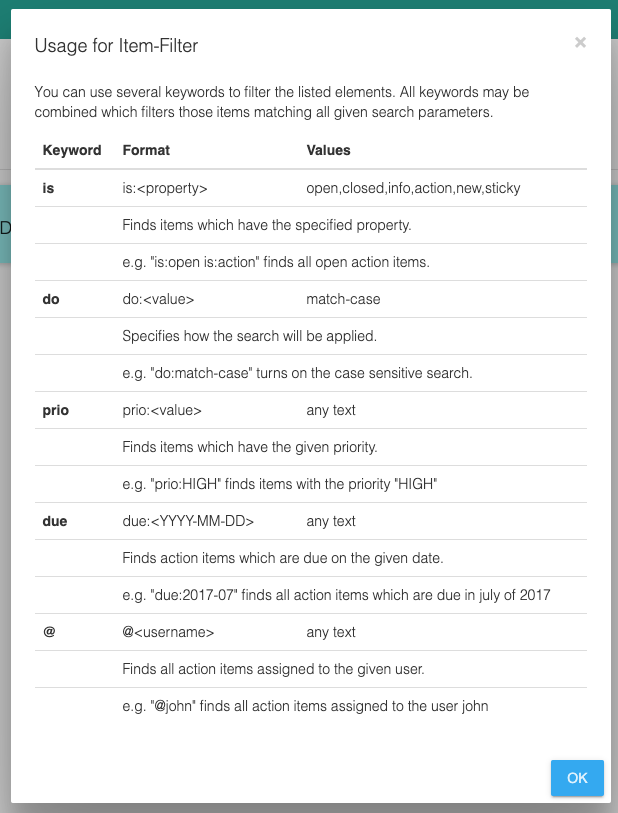

## 004.1-Screen.Minutes.png

Precondition:

* Create meeting series
* Create two meeting minutes

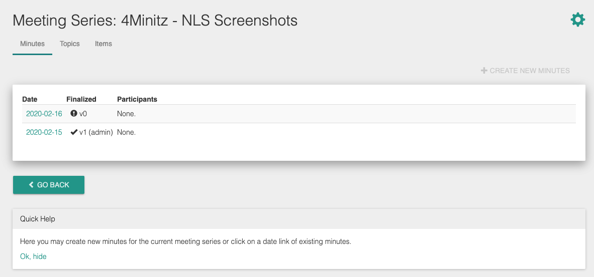

## 004.1-Screen.MinutesNonModerator.png

Precondition:

* Non moderator is invited to meeting series
* Button 'Leave Meeting Series' should show up

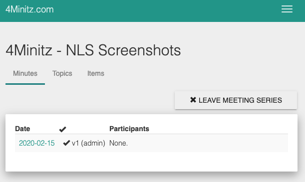

## 004.1-Msg.MinutesNonModeratorLeaveConfirmation.png

Precondition:

* Non moderator is invited to meeting series
* Button 'Leave Meeting Series' should show up

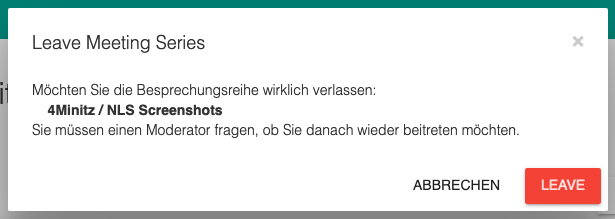

## 004.2-Screen.Minutes.Topics.png

Precondition:

* On Meeting Series Topic list
* A closed topic has menu 'Reopen Topic'

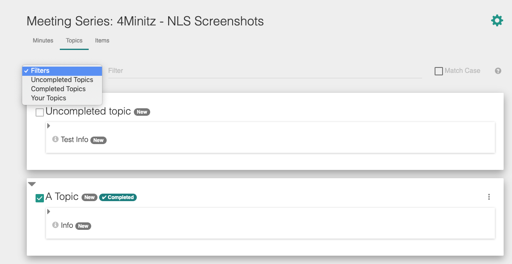

## 004.2-Dlg.Minutes.TopicsFilter.png

Precondition:

* On Meeting Series Topic list
* Open topic filters
* Click '?' question mark for help

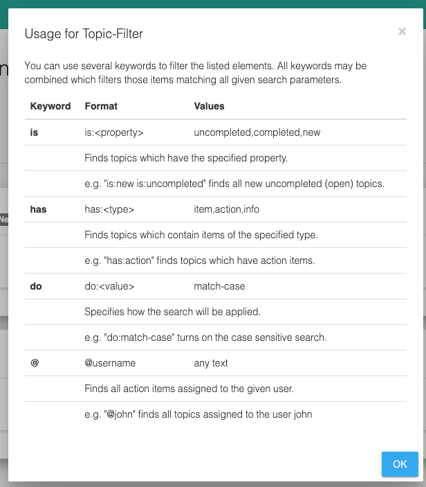

## 004.2-Menu.Minutes.Topics-Reopen.png

Precondition:

* On Meeting Series Topic list
* A closed topic shows 'Reopen Topic' menu

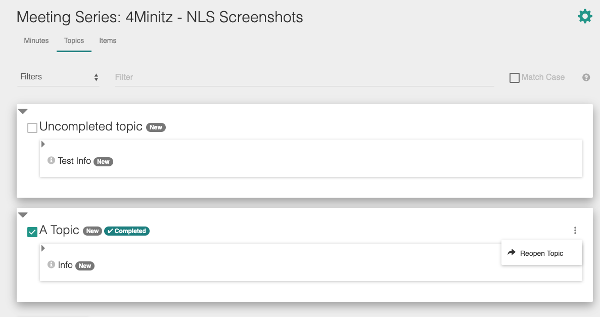

## 004.2-Msg.Minutes.Topics-ReopenConfirmation.png

Precondition:

* On Meeting Series goto Topic list
* On a closed toipic from three-dot menu select 'Reopen Topic'

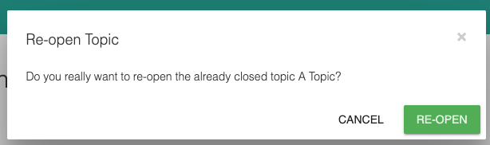

## 004.3-Dlg.Minutes-ItemsFilter.png

Precondition:

* On Meeting Series Item List
* Item filter
* Click '?' question mark for help

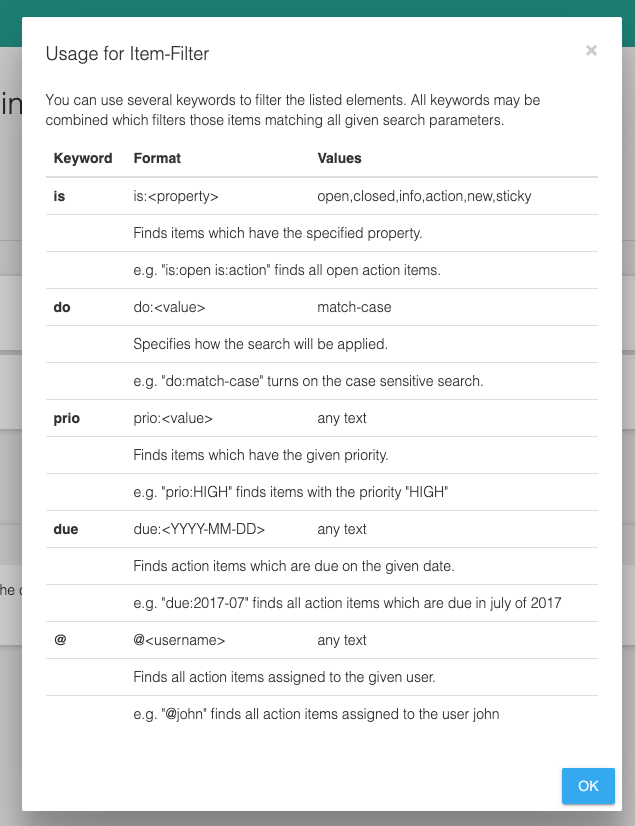

## 004.3-Screen.Minutes-Items.png

Precondition:

* On Meeting Series Item List

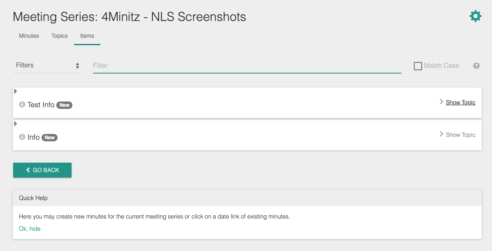

## 004.3-Dlg.Minutes-ItemsFilter.png

Precondition:

* On Meeting Series Item List
* Item filter
* Click '?' question mark for help

## 004.4-Screen.OneTopic.png

Precondition:

* On Meeting Series Item List
* Click on 'Show Topic'

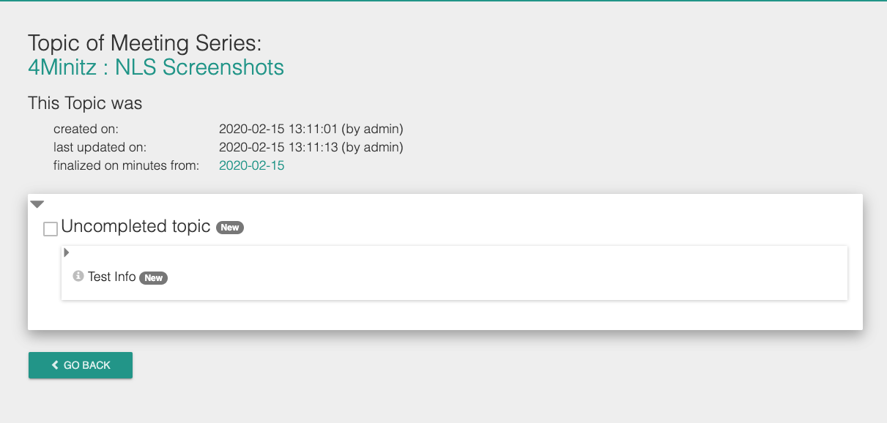

## 005.1-Screen.MinutesEdit.png

Precondition:

* Create Meeting Series
* Create new Meeting Minutes

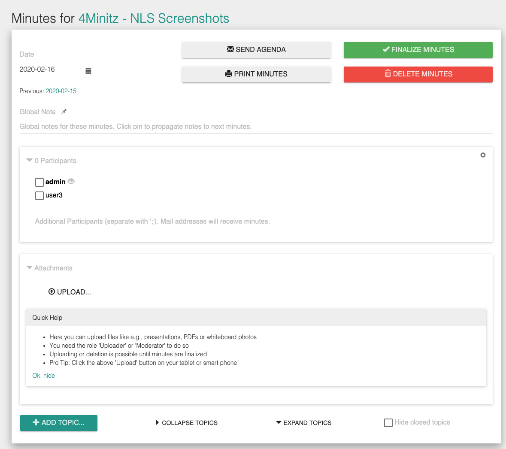

## 005.1-Dlg.MinutesEdit-DateTimePicker.png

Precondition:

* On Minutes Edit click calandar icon
* **Hint: Currently the date picker is NOT translated!!!**

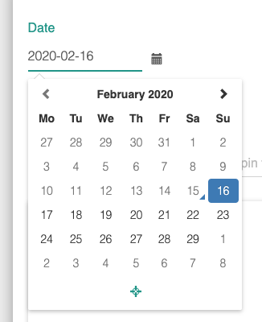

## 005.1-Msg.MinutesEdit.UploadError.png

Precondition:

* Create new Meeting Minutes
* Try to upload a file that is bigger than settings.json allows

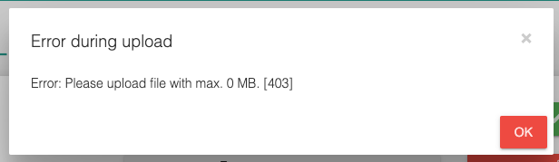

## 005.1-Msg.MinutesEdit.UploadDeleteConfirmation.png

Precondition:

* Create new Meeting Minutes
* Upload a file attachment
* Click red "X" next to attachment file to delete it

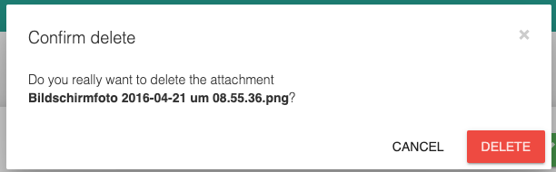

## 005.1-Menu.MinutesEdit.Topic.png

Precondition:

* In Minutes Edit
* Create Topic
* Open Tree-Dot-Menu on Topic Item

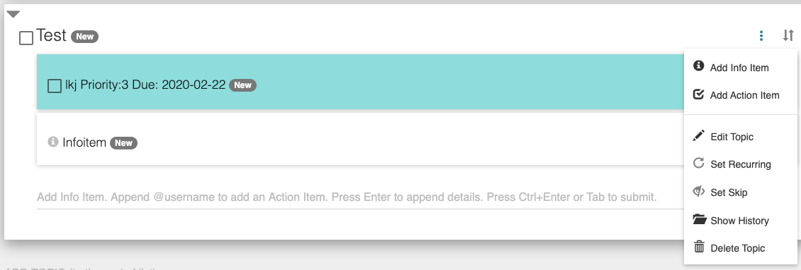

## 005.1-Menu.MinutesEdit.ActionItem.png

Precondition:

* In Minutes Edit
* Create Topic
* Add Action Item to Topic
* Open Tree-Dot-Menu on Action Item

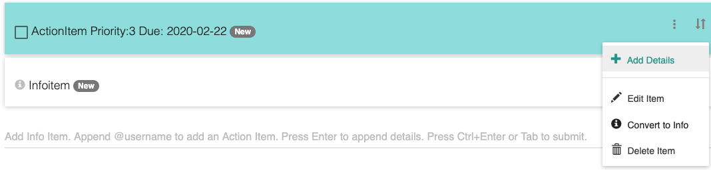

## 005.1-Menu.MinutesEdit.InfoItem.png

Precondition:

* In Minutes Edit
* Create Topic
* Add Info Item to Topic
* Open Three-Dot-Menu on Info Item

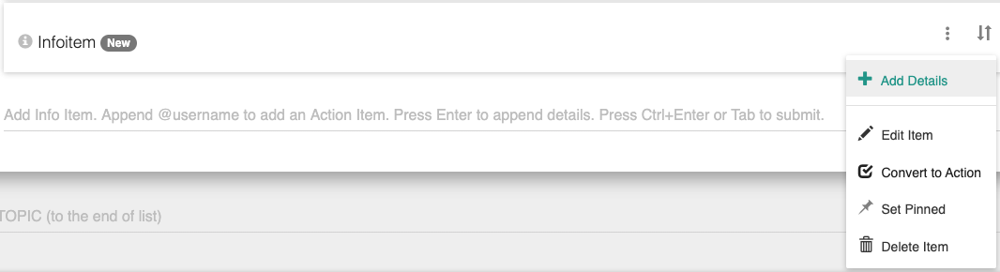

## 005.1-Dlg.MinutesEdit.ItemConvert.png

Precondition:

* In Minutes Edit
* Create Topic
* Add Action Item to Topic
* Finalize Minutes, create new Minutes
* Open Three-Dot-Menu on Action Item
* Click 'Convert'

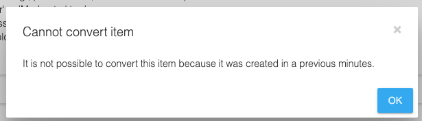

## 005.1-Msg.MinutesEdit.AgendaResend.png

Precondition:

* In Minutes Edit
* Click "Send Agenda" once
* Click "Send Agenda" second time

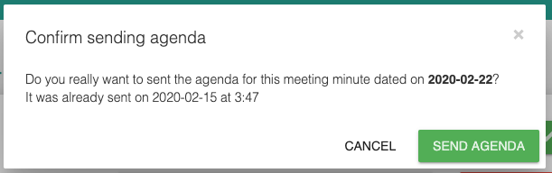

## 005.2-Dlg.MinutesEdit.TopicEdit.png

Precondition:

* In Minutes Edit
* Add Topic

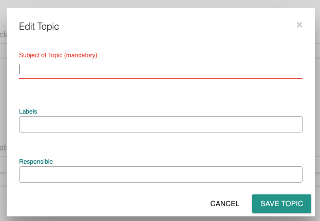

## 005.2-Dlg.MinutesEdit.InfoItemEdit.png

Precondition:

* In Minutes Edit
* Add Topic
* Add Info Item to topic

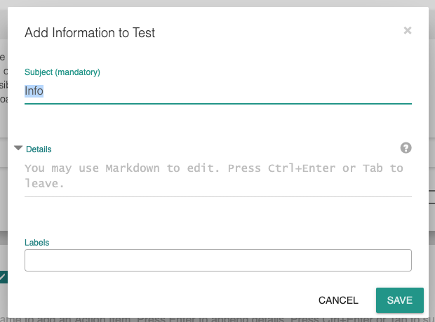

## 005.2-Dlg.MinutesEdit.ActionItemEdit.png

Precondition:

* In Minutes Edit
* Add Topic
* Add Action Item to topic

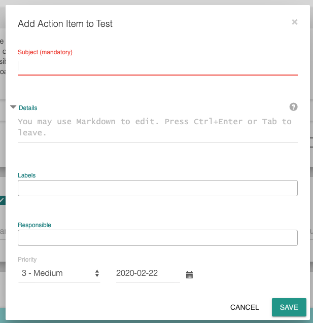

## 005.4-Msg.MinutesEdit-ConfirmDeleteAction.png

Precondition:

* In Minutes Edit
* Create topic / actionitem
* Delete action item

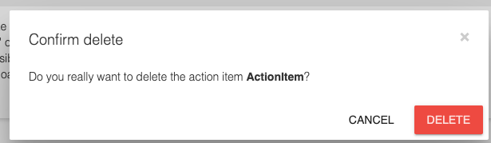

## 005.4-Msg.MinutesEdit-ConfirmDeleteDetails.png

Precondition:

* In Minutes Edit
* Create topic / actionitem / details
* Delete all text in details
* click outside to remove focus of details

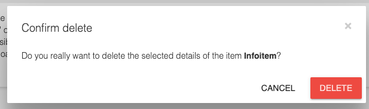

## 005.4-Msg.MinutesEdit-ConfirmDeleteInfo.png

Precondition:

* In Minutes Edit
* Create topic / info item
* Delete info item

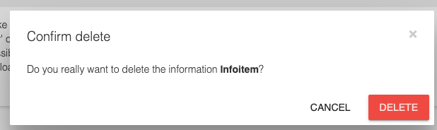

## 005.4-Msg.MinutesEdit-ConfirmDeleteTopic.png

Precondition:

* In Minutes Edit
* Create topic
* Delete topic

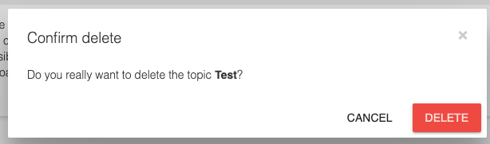

## 005.4-Msg.MinutesEdit-ConfirmDeleteMinutes.png

Precondition:

* In Minutes Edit
* Create topic
* Finalize Minutes, create new Minutes
* Tick 1st topic as discussed
* Create 2nd topic
* Click "Delete Minutes"

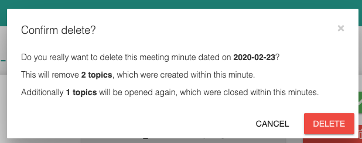

## 005.3-Msg.MinutesEdit.FinalizeWarning.png

Precondition:

* In Minutes Edit
* Create topic with Action Item (without responsible!)
* Make sure no participants are marked
* Make sure no topics marked as discussed
* Click Finalize button

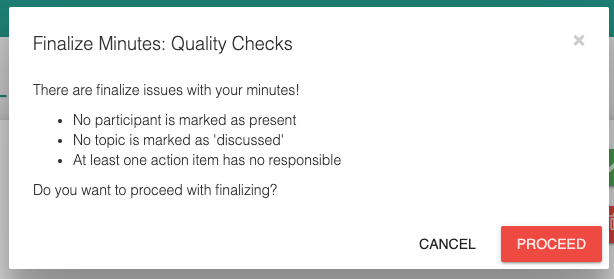

## 005.3-Msg.MinutesEdit.FinalizeWarning2.png

Precondition:

* In Minutes Edit
* Create topic with Action Item (without responsible!)
* Make sure no participants are marked
* Make sure one topics marked as discussed - but topic has no embedded item
* Click Finalize button

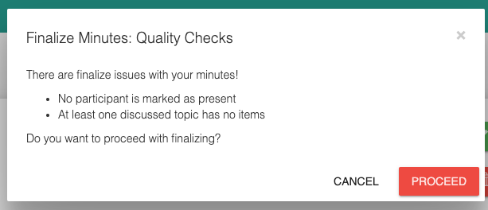

## 005.3-Dlg.MinutesEdit.Finalize.png

Precondition:

* Create Meeting Minutes
* Create one topic with one action item
* Click Finalize button

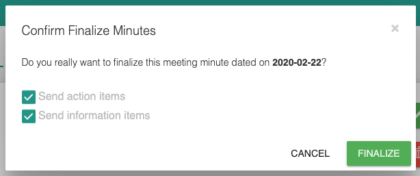

## 005.3-Msg.MinutesEdit.Finalize.png

Precondition:

* In Minutes Edit
* Click Finalize button
* Splash message after successful Minutes Finalize

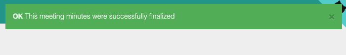

## 006.1-Screen.Admin.Users.png

Precondition:

* Login admin user
* In user menu select 'Admin Tasks'

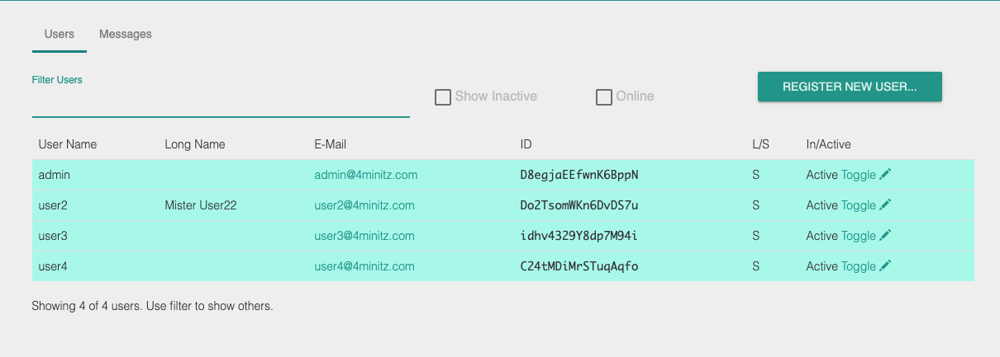

## 006.1-Dlg.Admin.NewUser.png

Precondition:

* Login admin user
* In user menu select 'Admin Tasks'
* Click 'Register New User'

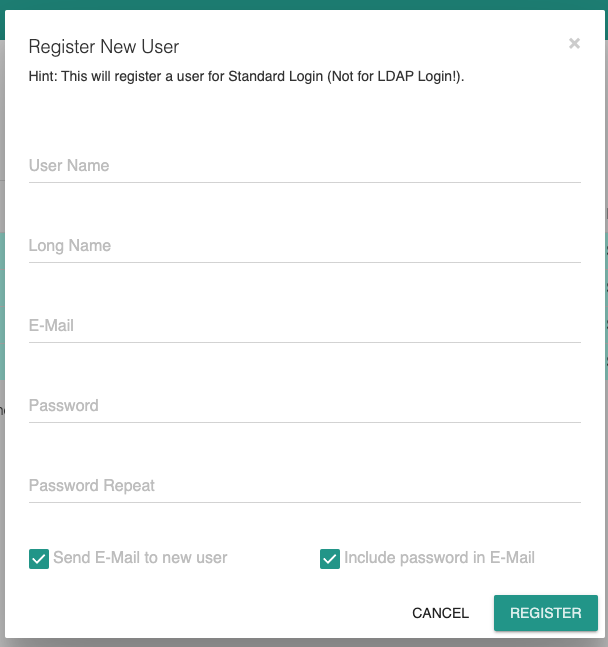

## 006.2-Screen.Admin.Messages.png

Precondition:

* Login admin user
* In user menu select 'Admin Tasks'
* Click tab 'Messages'

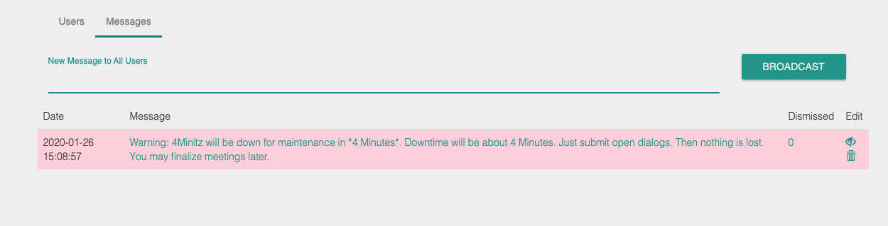

## 007.1-Mail.Agenda.png

Precondition:

* Set email.enableMailDelivery = true in ./settings.json and configure accordingly
* Create new Meeting Minutes
* Create one topic
* Click "Send Agenda"

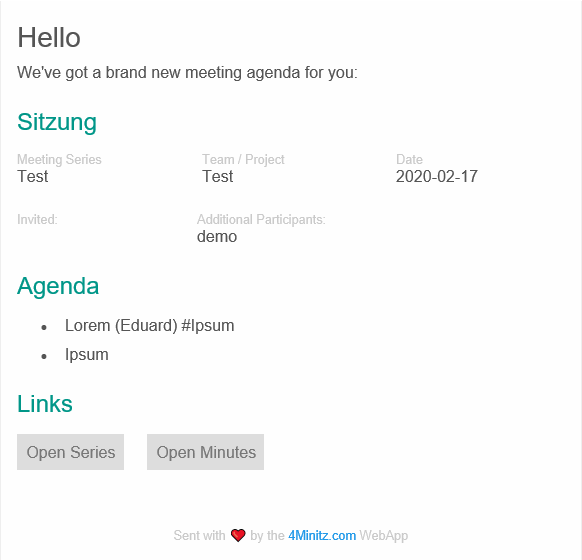

## 007.2-Mail.ActionItems.png

Precondition:

* Set email.enableMailDelivery = true in ./settings.json and configure accordingly
* Create new Meeting Minutes
* Create one topic with one action item and assign it yourself
* Click Finalize button

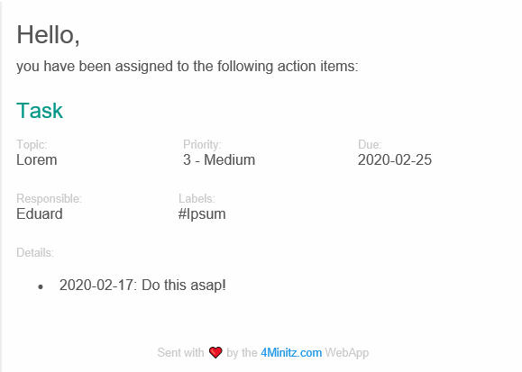

## 007.3-Mail.FinishedAgenda.png

Precondition:

* Set email.enableMailDelivery = true in ./settings.json and configure accordingly
* Create new Meeting Minutes
* Create one topic
* Click Finalize button

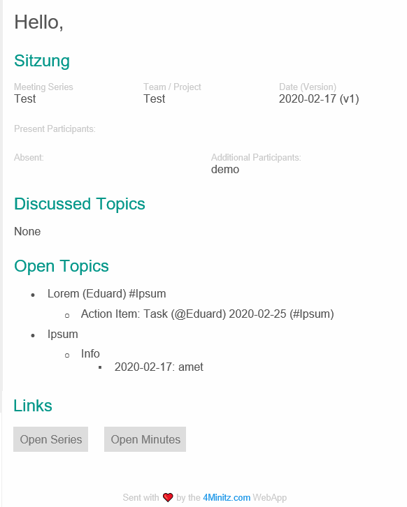

## 007.4-Mail.ResetPassword.png

Precondition:

* No user logged in
* Click 'Forgot Your Password' and enter your email address

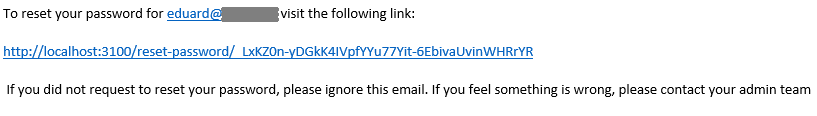

## 007.5-Mail.RoleChange.png

Precondition:

* Set email.enableMailDelivery = true in ./settings.json and configure accordingly
* Make sure second user with Mail address exists
* Create a new Meeting Series
* Invite second user to meeting series

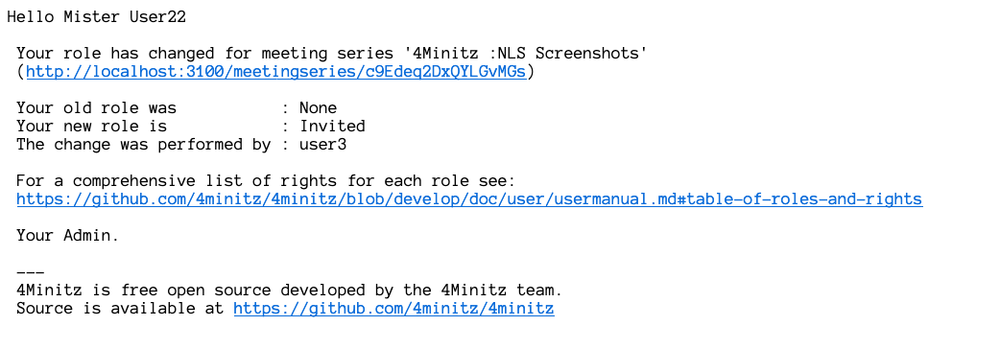
